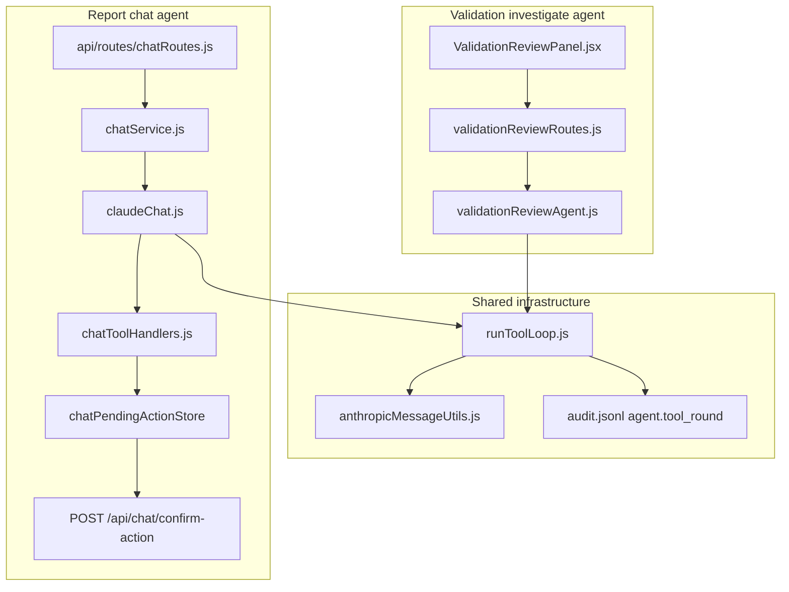
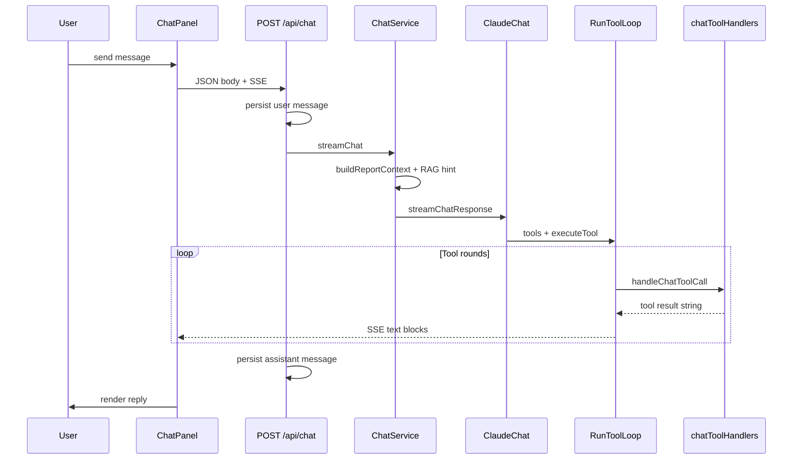
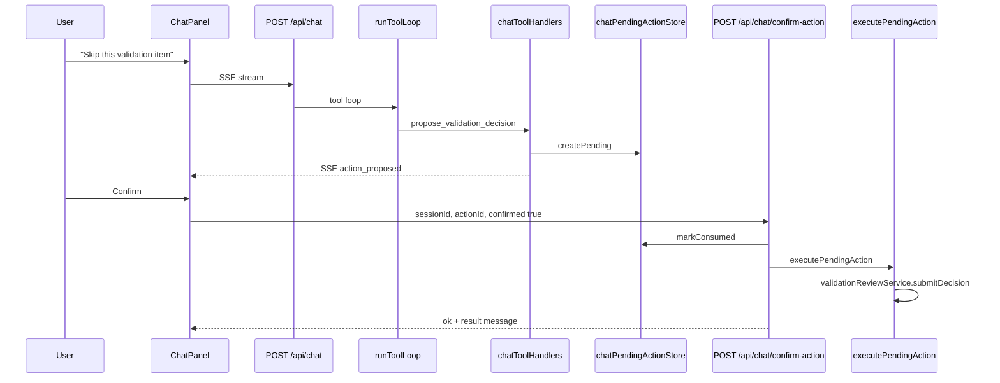

# Agentic Mechanisms — Architecture Reference

**Location:** `docs/main_docu_files/` (canonical main documentation — see [README](./README.md))

This document is the **canonical reference for LLM agent behavior** in this repository: tool-use loops, human-in-the-loop (HITL) confirm flows, validation investigate UX, tool profiles, observability, security gates, and explicit boundaries between *agents* and other LLM usage.

**Companion docs (do not duplicate here):**

| Doc | Scope |
|-----|--------|
| [LLM_CHAT.md](./LLM_CHAT.md) | Chat UX, sessions, SSE streaming protocol, per-tool API behavior, RAG-in-chat wiring |
| [RAG.md](./RAG.md) | Hybrid retrieval platform (`rag_chunks`, indexing, namespaces, ops scripts) |
| [8-component-analysis-end-to-end.md](./8-component-analysis-end-to-end.md) | Scoring pipeline, validation queue semantics, analyst vs operator display |
| [MODEL-CARD.md](../MODEL-CARD.md) | Operator instruments and feature-flag summary |

---

## 1. Executive summary

### 1.1 What counts as an “agent” in this repo

An **agent** is defined as:

> **Claude Haiku** (Anthropic Messages API) + a **bounded tool-use loop** implemented by [`runToolLoop`](../../cross-cut-modules/llm/runToolLoop.js), with at most **5 tool rounds** per user turn.

Anything that is a **single** `messages.create()` call without tools is **LLM-assisted** but **not** an agent (validation one-shot explain, catalog proposal drafts, chat title generation, pipeline extract/narratives).

The app currently runs **two agent stacks** that share infrastructure:

1. **Report chat agent** — general Q&A about the resilience report; ~19 tools when analyst + confirm flags are on.
2. **Validation investigate agent** — scoped multi-turn investigation of a single validation queue item; 3 dedicated tools.

There is **no multi-agent** architecture (no researcher/writer/supervisor split). Tool **profiles** narrow the chat tool set instead of spawning sub-agents.

### 1.2 Design principles

| Principle | Meaning in practice |
|-----------|---------------------|
| **LLM extracts, code scores** | Batch pipeline (`extract-signals`, `assess-signals`, deterministic scoring) must **not** be agentified. Agents read and explain; they do not re-score. |
| **Mutations require human confirm** | Write paths use `propose_*` tools + second HTTP call (chat) or explicit panel button (validation). The model must never claim a mutation succeeded until the human confirms. |
| **Single agent, scoped tools** | Prefer `toolProfile: 'validation'` over a second agent process. Validation panel keeps a dedicated `/agent` route for UX, not for multi-agent complexity. |
| **Evidence-first** | System prompts instruct cite-from-retrieval behavior; validation prompts forbid inventing quotes. |
| **Bounded cost** | Max 5 tool rounds; pending actions expire after 15 minutes; chat is behind costly-route pre-handlers. |

### 1.3 High-level architecture



---

## 2. Shared agent infrastructure

### 2.1 `runToolLoop` — the canonical tool-use loop

**File:** [`cross-cut-modules/llm/runToolLoop.js`](../../cross-cut-modules/llm/runToolLoop.js)

Both chat and validation agents delegate to this function. It encapsulates the Anthropic tool-use iteration pattern previously duplicated in `claudeChat.js` and `validationReviewAgent.js`.

#### API contract

```javascript
export async function runToolLoop({
  client,           // Anthropic client (or test mock) with messages.create
  model,            // e.g. 'claude-haiku-4-5-20251001'
  system,           // system prompt string
  messages,         // Anthropic message array
  tools,            // tool schema array
  maxRounds = 5,
  maxTokens = 4000,
  temperature = 0,
  executeTool,      // async (name, input, toolUseBlock) => string
  onTextBlock,      // optional (text) => void — chat streams each text block
  onToolRound,      // optional (meta) => void — extension hook
  agentKind = 'unknown',  // 'chat' | 'validation' — for audit
  auditLogPath,     // optional override for audit.jsonl
})
```

#### Return value

```javascript
{
  messages,           // full conversation including tool_use / tool_result turns
  lastAssistantText,  // extracted final assistant text (see anthropicMessageUtils)
  stopReason,         // Anthropic stop_reason from last call
  usage,              // token usage from last call (when present)
}
```

#### Round algorithm

For each round `0 … maxRounds`:

1. Call `client.messages.create({ model, system, messages, tools, max_tokens, temperature })`.
2. Split `response.content` into `text` blocks and `tool_use` blocks.
3. Invoke `onTextBlock(text)` for each text block (chat uses this to SSE-stream to the client).
4. If there are **no** tool_use blocks, or `stop_reason === 'end_turn'`:
   - Append a normalized assistant message (string content) when text exists.
   - **Break** the loop.
5. Otherwise, for each `tool_use`:
   - Call `executeTool(name, input, toolUseBlock)` and measure latency.
   - Build `tool_result` blocks with string content.
6. Append to `messages`:
   - `{ role: 'assistant', content: response.content }` (full block array),
   - `{ role: 'user', content: toolResults }`.
7. Emit audit event (see §2.3) and optional `onToolRound` callback.
8. Continue to next round.

When the round cap is hit without `end_turn`, the loop exits with whatever messages have accumulated; the model may not have produced a final natural-language answer.

#### Testability

Pass a fake `client` whose `messages.create` returns scripted responses. See [`tests/cross-cut-modules/llm/runToolLoop.test.js`](../../tests/cross-cut-modules/llm/runToolLoop.test.js).

Validation agent accepts optional `client` in [`runValidationAgent`](../../business_modules/resilience/validation/app/validationReviewAgent.js) for the same pattern.

### 2.2 `anthropicMessageUtils` — message content helpers

**File:** [`cross-cut-modules/llm/anthropicMessageUtils.js`](../../cross-cut-modules/llm/anthropicMessageUtils.js)

After tool rounds, Anthropic assistant messages store `content` as an **array of blocks** (`text`, `tool_use`), not a plain string. Code that assumes `typeof content === 'string'` will return empty answers — a bug fixed during Analyst Agent Polish.

| Function | Purpose |
|----------|---------|
| `extractTextFromContent(content)` | String → string; array → join all `type === 'text'` blocks |
| `extractLastAssistantText(messages)` | Walk history reversed; return text from last assistant message |
| `simplifyMessagesForDisplay(messages)` | User-facing transcript: user strings + assistant text; skips tool_result-only user turns |

**Client mirror:** [`client/src/lib/anthropicMessageUtils.js`](../../client/src/lib/anthropicMessageUtils.js) — used by `ValidationReviewPanel` for investigate transcript rendering.

### 2.3 Observability — audit logging

Each completed tool round writes a structured row to the audit log via [`appendAuditEvent`](../../cross-cut-modules/security/input/auditLog.js):

```json
{
  "ts": "2026-05-30T12:00:00.000Z",
  "action": "agent.tool_round",
  "meta": {
    "agent": "chat",
    "round": 0,
    "model": "claude-haiku-4-5-20251001",
    "tools": [
      { "name": "lookup_signals", "latencyMs": 42, "resultBytes": 1204 }
    ],
    "usage": { "input_tokens": 800, "output_tokens": 120 }
  }
}
```

- Default log path: `log/data/audit.jsonl` (override with `AUDIT_LOG_PATH`).
- Audit failure is swallowed so logging never breaks the agent loop.
- Validation agent POST also calls `auditFromRequest(request, 'validation.agent', …)` at route level.

Additional chat audit events: `chat.post`, `chat.confirm_action`, `chat.confirm_action_rejected`.

---

## 3. Primary agent: report chat

The report chat agent helps users understand the **current resilience report** (scores, narratives, evidence, changes over time) and drill down via tools into PBO data, raw signals, source archive documents, and analyst workflows.

### 3.1 Stack map

| Layer | File | Role |
|-------|------|------|
| HTTP routes | [`api/routes/chatRoutes.js`](../../api/routes/chatRoutes.js) | Sessions CRUD, `POST /api/chat` SSE stream, `POST /api/chat/confirm-action` |
| App orchestration | [`business_modules/chat/app/chatService.js`](../../business_modules/chat/app/chatService.js) | Report context, RAG hint, history trim, delegates to `streamChatResponse` |
| Loop + system template | [`business_modules/chat/infrastructure/claudeChat.js`](../../business_modules/chat/infrastructure/claudeChat.js) | Builds system prompt, calls `runToolLoop`, `generateChatTitle` |
| Tool schemas | [`business_modules/chat/domain/tools/chatToolSchemas.js`](../../business_modules/chat/domain/tools/chatToolSchemas.js) | Anthropic tool definitions, `buildChatToolList`, `TOOL_PROFILES` |
| Tool handlers | [`business_modules/chat/app/chatToolHandlers.js`](../../business_modules/chat/app/chatToolHandlers.js) | `(toolName, input, ctx) => string` implementations |
| DI / gates | [`business_modules/chat/app/createChatToolContext.js`](../../business_modules/chat/app/createChatToolContext.js) | Wires services, analyst flags, tool list |
| Session store | [`business_modules/chat/infrastructure/chatStore.js`](../../business_modules/chat/infrastructure/chatStore.js) | SQLite sessions + messages |
| Pending actions | [`business_modules/chat/infrastructure/chatPendingActionStore.js`](../../business_modules/chat/infrastructure/chatPendingActionStore.js) | Confirm-gated mutation staging |
| Execute confirm | [`business_modules/chat/app/executePendingAction.js`](../../business_modules/chat/app/executePendingAction.js) | Runs confirmed propose tools |
| Client hook | [`client/src/hooks/useChat.js`](../../client/src/hooks/useChat.js) | SSE parsing, sessions, `confirmAction` |
| Client UI | [`client/src/components/ChatPanel.jsx`](../../client/src/components/ChatPanel.jsx) | Desktop popup chat, pending action cards |

Wired in [`app.js`](../../app.js) via `chatRoutes(app, { … })`.

### 3.2 Request flow (`POST /api/chat`)



#### Request body (relevant fields)

| Field | Purpose |
|-------|---------|
| `sessionId` | Required. SQLite session owned by authenticated user. |
| `message` | User text (for `action: send`). |
| `action` | `send`, `regenerate`, `continue`, `edit_resend` — see [LLM_CHAT.md](./LLM_CHAT.md). |
| `scope` | Optional component focus hint. |
| `reportGeoScope` | `national` \| `north` — anchors report cache to UI toggle. |
| `view` | Display tier hint; resolved via `resolveDisplayView`. |
| `toolProfile` | `default` \| `validation` \| `sources` — restricts exposed tools. |

#### Grounding layers (in order)

1. **Report payload** — `buildReportContext(reportData)` injects scores (analyst tier), component summaries, PBO index into system context. Operator tier gets redacted payload via `redactReportPayload`.
2. **RAG retrieval hint** — when `RAG_PIPELINE_ENABLED`, `buildChatRetrievalHint` adds top chunks + source_ids before the model chooses tools.
3. **Session history** — up to **20** prior user/assistant messages from SQLite.
4. **On-demand tools** — signals, sources, analyst queues fetched during the loop.

Model: **`claude-haiku-4-5-20251001`**, `max_tokens: 4000`.

### 3.3 Tool inventory

Tool schemas: [`chatToolSchemas.js`](../../business_modules/chat/domain/tools/chatToolSchemas.js).  
Handlers: [`chatToolHandlers.js`](../../business_modules/chat/app/chatToolHandlers.js).

#### Core tools (all authenticated chat users)

| Tool | Purpose | Analyst only |
|------|---------|--------------|
| `lookup_pbo` | Per-municipality PBO scores and field observations | No |
| `lookup_signals` | Search raw behavioral signals by query/component/source/date | No |
| `compare_dates` | Per-component score deltas and narrative shifts between two dates | No |
| `generate_brief` | Structured brief for commander/analyst/public audience | No |
| `list_sources` | Browse source archive by date/type without text query | No |
| `search_sources` | Text/url/title search; returns `source_id` for `get_source` | No |
| `get_source` | Full original document text by `source_id` | No |

Legacy aliases (one release): `search_evidence`, `lookup_evidence` → same as source tools.

#### Analyst read tools (`canViewAnalystDisplay` + `CHAT_ANALYST_TOOLS_ENABLED`)

| Tool | Purpose |
|------|---------|
| `search_pbo_history` | RAG search over historical PBO municipal reports |
| `list_pbo_reviews` | List PBO review records for a date |
| `get_pbo_review` | PBO review detail for municipality + date |
| `get_resilience_drift` | Drift time series and alerts for a scope |
| `list_validation_queue` | Pending validation items for date/scope |
| `get_validation_item` | Queue item + RAG context bundle (formatted text) |
| `explain_validation_item` | One-shot Haiku explain (same backend as panel Explain) |
| `list_geo_unknown` | Geo unknown locality review queue |
| `list_catalog_proposals` | OOV catalog draft proposals |
| `get_catalog_gap_summary` | Recent OOV cluster summary |

#### Confirm-gated propose tools (`CHAT_CONFIRM_ACTIONS_ENABLED`)

| Tool | Mutation on confirm |
|------|---------------------|
| `propose_validation_decision` | `validationReviewService.submitDecision` |
| `propose_geo_unknown_update` | `geoUnknownReviewService.updateStatus` |
| `propose_catalog_proposal_review` | `catalogProposalService.reviewProposal` |

Propose tools **never execute immediately**. They create a row in `chat_pending_actions` and emit SSE `action_proposed`.

### 3.4 Tool profiles

Defined in `TOOL_PROFILES` in [`chatToolSchemas.js`](../../business_modules/chat/domain/tools/chatToolSchemas.js). Passed via `createChatToolContext({ toolProfile })` from `POST /api/chat` body.

| Profile | Tool names exposed | Typical use |
|---------|-------------------|-------------|
| `default` | Core + analyst read + propose (when flags allow) | General report Q&A |
| `validation` | `list_validation_queue`, `get_validation_item`, `explain_validation_item`, `lookup_signals`, `search_sources`, `get_source`, `propose_validation_decision` | Validation-focused chat without unrelated tools |
| `sources` | `list_sources`, `search_sources`, `get_source` | Archive-only drill-down |

When `toolProfile === 'validation'`, [`claudeChat.js`](../../business_modules/chat/infrastructure/claudeChat.js) adds a system guideline:

> Validation mode: focus on queue items and evidence; use `propose_validation_decision` after investigation (user must confirm).

`buildSystemTemplateToolList` returns a reduced tool bullet list per profile so the model sees only relevant capabilities.

### 3.5 Access gates

| Gate | Mechanism |
|------|-----------|
| Authentication | Firebase auth on all chat routes |
| Analyst tools | `canViewAnalystDisplay(email)` — config in `userAccess.json` / `RESILIENCE_ANALYST_EMAILS` |
| Analyst tools flag | `CHAT_ANALYST_TOOLS_ENABLED !== '0'` |
| Confirm actions flag | `CHAT_CONFIRM_ACTIONS_ENABLED !== '0'` |
| Display tier | `resolveDisplayView` — analysts get full scores in report context for `compare_dates` / briefs |
| Maintainer-only mode | `CHAT_MAINTAINER_ONLY=true` restricts `POST /api/chat` |
| Cost control | `costlyRoutePreHandlers` on streaming chat route |

Non-analysts calling analyst tools receive a string error from the handler (not a thrown exception).

### 3.6 SSE streaming (client contract)

The chat agent streams Server-Sent Events during `POST /api/chat`. Event types:

| Event | Payload | Client behavior |
|-------|---------|-----------------|
| `{ type: 'text', text }` | Partial assistant text | Append to draft / accumulated buffer |
| `{ type: 'action_proposed', actionId, toolName, summary, expiresAt }` | Pending mutation | Show Confirm/Dismiss card in `ChatPanel` |
| `{ type: 'done' }` | — | Finalize assistant message in history |
| `{ type: 'error', message }` | Error string | Show error bubble |

Full protocol details: [LLM_CHAT.md § Streaming](./LLM_CHAT.md).

**Note:** `toolProfile` is accepted by the server but the default client (`useChat.js`) does not yet send it on every request; callers can pass it when integrating validation-scoped chat.

---

## 4. Human-in-the-loop (HITL) confirm protocol

All **mutations** initiated from the chat agent follow a two-step pattern: **propose** (model) → **confirm** (human).

### 4.1 Chat confirm flow



#### Pending action store

**File:** [`chatPendingActionStore.js`](../../business_modules/chat/infrastructure/chatPendingActionStore.js)

SQLite table `chat_pending_actions`:

| Column | Purpose |
|--------|---------|
| `id` | UUID action id returned to client |
| `owner_uid` | Must match authenticated user |
| `session_id` | Must match active chat session |
| `tool_name` | e.g. `propose_validation_decision` |
| `params_json` | Serialized tool input |
| `summary` | Human-readable card text |
| `expires_at` | Created + **15 minutes** (`PENDING_ACTION_TTL_MS`) |
| `consumed_at` | Set on confirm or reject |

#### Confirm route

**`POST /api/chat/confirm-action`**

```json
{ "sessionId": "uuid", "actionId": "uuid", "confirmed": true }
```

| Status | Condition |
|--------|-----------|
| 200 + `{ ok: true, result }` | Confirmed and executed |
| 200 + `{ ok: true, rejected: true }` | User dismissed (`confirmed: false`) |
| 403 | Non-analyst |
| 404 | Session or action not found / wrong owner |
| 409 | Action already consumed |
| 410 | Action expired |

Execution map in [`executePendingAction.js`](../../business_modules/chat/app/executePendingAction.js):

| Tool | Service call |
|------|--------------|
| `propose_validation_decision` | `validationReviewService.submitDecision(date, scope, article_key, …)` |
| `propose_geo_unknown_update` | `geoUnknownReviewService.updateStatus(id, …)` |
| `propose_catalog_proposal_review` | `catalogProposalService.reviewProposal(proposal_id, …)` |

#### Client UI

[`ChatPanel.jsx`](../../client/src/components/ChatPanel.jsx) renders an alert per pending action with **Dismiss** (`confirmed: false`) and **Confirm** (`confirmed: true`). [`useChat.js`](../../client/src/hooks/useChat.js) maintains `pendingActions` state updated from SSE `action_proposed`.

### 4.2 Validation panel HITL (parallel path)

The validation investigate agent uses tool `propose_decision`, which sets `recommendation: { action, rationale }` in the HTTP response — **not** the chat pending store.

The analyst clicks **Apply recommendation ({action})** in [`ValidationReviewPanel.jsx`](../../client/src/components/ValidationReviewPanel.jsx), which calls `submitDecision(articleKey, action, { note: rationale })` directly.

Both paths enforce the same rule: **the model recommends; the human applies.**

---

## 5. Secondary agent: validation investigate

### 5.1 Purpose

Analysts review articles flagged during blind scoring (OOV suggestions, low-confidence extractions, epistemic overrides). The **Investigate** mode runs a multi-turn agent that can refresh RAG context, search similar archive articles, and recommend skip/label/defer — without auto-submitting decisions.

### 5.2 HTTP API

**Route:** `POST /api/validation/review-queue/:date/:scope/:articleKey/agent`

**File:** [`validationReviewRoutes.js`](../../business_modules/resilience/validation/input/validationReviewRoutes.js)

**Auth:** Analyst only (`canViewAnalystDisplay`); 403 `analyst_view_required` otherwise.

**Request body:**

```json
{
  "messages": [
    { "role": "user", "content": "Investigate why this article was flagged." },
    { "role": "assistant", "content": "..." },
    { "role": "user", "content": "..." }
  ]
}
```

Messages may contain assistant `content` as **string or block array** (full Anthropic round-trip for multi-turn).

**Response:**

```json
{
  "messages": [ "... full thread ..." ],
  "answer": "Final natural-language summary",
  "recommendation": { "action": "skip", "rationale": "..." },
  "model": "claude-haiku-4-5-20251001",
  "item": { "... queue item ..." },
  "stopReason": "end_turn",
  "usage": { "input_tokens": 0, "output_tokens": 0 }
}
```

On disable or missing item: `{ "error": "...", "messages": [...] }` with 404/503.

Related read-only routes (not agents):

| Method | Route | Purpose |
|--------|-------|---------|
| GET | `/api/validation/review-queue` | List queue |
| GET | `…/:articleKey` | Item detail |
| GET | `…/:articleKey/context` | RAG bundle for UI |
| POST | `…/:articleKey/explain` | One-shot explain |
| POST | `…/:articleKey/decision` | Human decision (direct) |

### 5.3 Agent implementation

**File:** [`validationReviewAgent.js`](../../business_modules/resilience/validation/app/validationReviewAgent.js)

Calls `runToolLoop` with `agentKind: 'validation'`, `maxTokens: 2000`.

**Model:** `RESILIENCE_VALIDATION_EXPLAIN_MODEL` → `RESILIENCE_SELF_CHECK_MODEL` → default Haiku.

**System prompt:** `buildValidationExplainSystemPrompt()` + frozen item context block from `buildValidationExplainUserBlock`.

#### Agent tools

| Tool | Input | Behavior |
|------|-------|----------|
| `get_validation_context` | `{}` | Refresh `validationReviewService.getItemContext`; return formatted RAG block |
| `search_similar_articles` | `{ query, top_k? }` | `retrieveSimilarArticles` via hybrid retrieval, or fallback to cached similar list |
| `propose_decision` | `{ action, rationale }` | Sets `recommendation` side effect; returns acknowledgment string |

Allowed `action` values: `label`, `skip`, `defer`, `gold_signal`, `confirm_social_quarantine`, `dismiss_social_quarantine`.

### 5.4 Multi-turn client UX

**Hook:** [`useValidationReviewQueue.js`](../../client/src/hooks/useValidationReviewQueue.js)

```javascript
agentTurn(articleKey, priorMessages, { followUp?: string })
```

When `followUp` is set, the hook appends `{ role: 'user', content: followUp }` before POST.

**Panel:** [`ValidationReviewPanel.jsx`](../../client/src/components/ValidationReviewPanel.jsx)

| State key | Purpose |
|-----------|---------|
| `agentMessagesByKey` | Full server `messages` after each turn |
| `agentAnswerByKey` | Latest `answer` string |
| `agentRecommendationByKey` | Latest `recommendation` object |
| `agentFollowUpByKey` | Follow-up text field value |

UX elements:

- **Explain** vs **Investigate** mode toggle per item
- **Run investigation** — first turn (empty or prior messages)
- **Transcript** — `simplifyMessagesForDisplay(agentMessagesByKey[key])`
- **Ask follow-up** — text field + button
- **Apply recommendation** — `submitDecision` with recommended action
- State cleared on successful decision via `clearAgentState`

### 5.5 Shared validation prompts

**File:** [`validationExplainPrompt.js`](../../business_modules/resilience/validation/domain/services/validationExplainPrompt.js)

Used by:

- One-shot explain ([`validationReviewExplain.js`](../../business_modules/resilience/validation/app/validationReviewExplain.js))
- Investigate agent system + context blocks
- Chat tool `explain_validation_item` (via `validationReviewService.explainItem`)

Key instruction: *Answer only from provided chunks, signals, and reasons. Do not invent quotes.*

### 5.6 Explain vs Investigate vs chat — comparison

| Mode | Entry | Tools | Turns | Writes data |
|------|-------|-------|-------|-------------|
| Panel **Explain** | `POST …/explain` | None | 1 | No |
| Panel **Investigate** | `POST …/agent` | 3 validation tools | Multi | Recommendation only |
| Chat `explain_validation_item` | Chat tool handler | N/A (direct service call) | 1 | No |
| Chat `toolProfile: validation` | `POST /api/chat` | Subset + propose | Multi | Propose + confirm |

---

## 6. LLM-assisted but non-agent workflows

These use Anthropic (or other LLMs) but **must not** be confused with agents. **Do not** add tool loops to batch scoring or FSM bots.

| Workflow | File | Pattern | HITL |
|----------|------|---------|------|
| Validation one-shot explain | [`validationReviewExplain.js`](../../business_modules/resilience/validation/app/validationReviewExplain.js) | Single `messages.create`, no tools | N/A (read-only) |
| Catalog proposal draft | [`anthropicCatalogProposalAdapter.js`](../../business_modules/catalogLearning/infrastructure/adapters/anthropicCatalogProposalAdapter.js) | Single shot → JSON fields | Approve/reject in `CatalogProposalPanel` |
| Chat session title | `generateChatTitle` in [`claudeChat.js`](../../business_modules/chat/infrastructure/claudeChat.js) | Single shot after first message | N/A |
| Signal extraction | `extract-signals.js` | Fixed multipass prompts | Pipeline QA |
| Assessment / scoring | `assess-signals.js`, `behaviorSignals.js` | Deterministic code scores LLM extractions | Golden tests |
| Narrative generation | Narrative Haiku/Sonnet passes | RAG-grounded generation, no tools | Editor review |
| WhatsApp bot | `conversationStateMachine.js` | Rule-based FSM | User messages |

**Catalog proposal LLM** (`CATALOG_PROPOSAL_LLM_ENABLED`): drafts `suggested_signal_type`, label, definition from OOV cluster evidence — never writes `signalCatalog.js` directly.

---

## 7. Analyst UI surfaces

| Surface | File | Agent-related behavior |
|---------|------|------------------------|
| **ChatPanel** | [`client/src/components/ChatPanel.jsx`](../../client/src/components/ChatPanel.jsx) | Full chat agent; pending action Confirm/Dismiss |
| **ValidationReviewPanel** | [`client/src/components/ValidationReviewPanel.jsx`](../../client/src/components/ValidationReviewPanel.jsx) | Explain (one-shot), Investigate (agent), decision buttons |
| **CatalogProposalPanel** | [`client/src/components/CatalogProposalPanel.jsx`](../../client/src/components/CatalogProposalPanel.jsx) | LLM draft generation + human review |
| **OovAnomalyClustersPanel** | [`client/src/components/OovAnomalyClustersPanel.jsx`](../../client/src/components/OovAnomalyClustersPanel.jsx) | Link **Review catalog proposals** → scroll to catalog panel |
| **ReportView** | [`client/src/components/ReportView.jsx`](../../client/src/components/ReportView.jsx) | Wires validation + catalog panels; `catalogProposalsRef` for scroll |

Analyst-only sections gated by `showValidationReview` and `displayTier === 'analyst'`.

---

## 8. Configuration reference

### 8.1 Feature flags

| Environment variable | Default | Effect |
|---------------------|---------|--------|
| `CHAT_ANALYST_TOOLS_ENABLED` | on (`!== '0'`) | Analyst read tools in chat |
| `CHAT_CONFIRM_ACTIONS_ENABLED` | on | Propose tools + confirm route |
| `VALIDATION_AGENT_ENABLED` | on | `POST …/agent` investigate route |
| `VALIDATION_EXPLAIN_ENABLED` | on | Explain + agent (via `validationExplainEnabled`) |
| `VALIDATION_REVIEW_RAG_ENABLED` | follows RAG | RAG context for validation |
| `CATALOG_PROPOSAL_LLM_ENABLED` | on | Catalog draft LLM |
| `GEO_UNKNOWN_REVIEW_READ_ENABLED` | on | `list_geo_unknown` chat tool |
| `CHAT_MAINTAINER_ONLY` | off | Restrict chat to maintainers |
| `RAG_PIPELINE_ENABLED` | on | Chat RAG hint + validation retrieval |

Defined in [`business_modules/chat/domain/chatConfig.js`](../../business_modules/chat/domain/chatConfig.js) and [`cross-cut-modules/retrieval/ragConfig.js`](../../cross-cut-modules/retrieval/ragConfig.js).

### 8.2 Models and keys

| Setting | Value |
|---------|-------|
| Chat model | `claude-haiku-4-5-20251001` |
| Validation model | `RESILIENCE_VALIDATION_EXPLAIN_MODEL` or fallback Haiku |
| `ANTHROPIC_API_KEY` | Required for all agent and LLM-assist paths |
| Pending action TTL | 15 minutes (`PENDING_ACTION_TTL_MS`) |
| Max tool rounds | 5 (both agents) |
| Max chat history | 20 messages (`MAX_HISTORY_MESSAGES`) |

### 8.3 Analyst access

Analyst capabilities require `canViewAnalystDisplay(email)`:

- Config: `config/userAccess.json` levels `analyst` / `maintainer`
- Env override: `RESILIENCE_ANALYST_EMAILS` (comma-separated)

---

## 9. Security and safety

### 9.1 Authorization layers

1. **Firebase authentication** on all API routes.
2. **Session ownership** — chat sessions and pending actions scoped to `owner_uid`.
3. **Analyst gate** — validation routes and analyst chat tools check `canViewAnalystDisplay`.
4. **Confirm gate** — mutations require explicit second request or panel click.

### 9.2 Prompt safety

- Validation prompts: cite-only from frozen context; recommend actions but never claim applied.
- Chat system template: instructs propose tools for mutations; tells user to confirm in UI.
- `generate_brief` uses report context only — no external web access.

### 9.3 Operational safety

- Tool round cap prevents runaway loops.
- Pending actions expire to limit stale confirm windows.
- Audit log captures tool names and latency per round.
- Costly route pre-handlers throttle chat abuse.

### 9.4 What agents cannot do

- Modify `signalCatalog.js` or scoring weights directly.
- Bypass human confirm for validation/geo/catalog mutations in chat.
- Access other users' chat sessions or pending actions.
- Run without `ANTHROPIC_API_KEY` (calls fail at runtime).

---

## 10. Testing and offline evaluation

### 10.1 Unit and route tests

| Test file | Covers |
|-----------|--------|
| [`tests/cross-cut-modules/llm/runToolLoop.test.js`](../../tests/cross-cut-modules/llm/runToolLoop.test.js) | Shared loop: tool round + end_turn |
| [`tests/cross-cut-modules/llm/anthropicMessageUtils.test.js`](../../tests/cross-cut-modules/llm/anthropicMessageUtils.test.js) | Text extraction from block arrays |
| [`tests/business_modules/resilience/validation/app/validationReviewAgent.test.js`](../../tests/business_modules/resilience/validation/app/validationReviewAgent.test.js) | Mock Anthropic client; answer after tools; recommendation |
| [`tests/api/routes/chatRoutes.confirmAction.test.js`](../../tests/api/routes/chatRoutes.confirmAction.test.js) | Confirm, reject, 403, 404, 410 |
| [`tests/business_modules/chat/app/chatToolHandlers.test.js`](../../tests/business_modules/chat/app/chatToolHandlers.test.js) | Handlers, pending store, executePendingAction |
| [`tests/business_modules/chat/eval/chatAgentToolSelection.test.js`](../../tests/business_modules/chat/eval/chatAgentToolSelection.test.js) | Tool profiles vs golden fixture |

Run targeted suite:

```bash
node --test \
  tests/cross-cut-modules/llm/*.test.js \
  tests/business_modules/resilience/validation/app/validationReviewAgent.test.js \
  tests/api/routes/chatRoutes.confirmAction.test.js \
  tests/business_modules/chat/app/chatToolHandlers.test.js \
  tests/business_modules/chat/eval/chatAgentToolSelection.test.js
```

### 10.2 Offline eval fixture

[`tests/fixtures/chat-agent-golden.json`](../../tests/fixtures/chat-agent-golden.json) documents analyst questions with expected tool names per `toolProfile`. Used by `chatAgentToolSelection.test.js` to verify profile filtering **without live Anthropic calls**.

Future work (out of scope): live eval script in CI with recorded tool-selection accuracy and citation quality metrics.

---

## 11. Extension guide for maintainers

### 11.1 Adding a chat tool

1. Add schema to `CORE_CHAT_TOOLS`, `ANALYST_READ_TOOLS`, or `PROPOSE_TOOLS` in [`chatToolSchemas.js`](../../business_modules/chat/domain/tools/chatToolSchemas.js).
2. Implement handler in [`chatToolHandlers.js`](../../business_modules/chat/app/chatToolHandlers.js); register in `CHAT_TOOL_HANDLERS` or `handleProposeTool`.
3. If mutation: add executor in [`executePendingAction.js`](../../business_modules/chat/app/executePendingAction.js) and `PROPOSE_TOOL_NAMES` in [`chatConfig.js`](../../business_modules/chat/domain/chatConfig.js).
4. Wire any new service through [`createChatToolContext.js`](../../business_modules/chat/app/createChatToolContext.js) and [`app.js`](../../app.js) `chatRoutes` opts.
5. Optionally add to `TOOL_PROFILES.validation` or `TOOL_PROFILES.sources`.
6. Update system template list in `buildSystemTemplateToolList`.
7. Add test in [`chatToolHandlers.test.js`](../../tests/business_modules/chat/app/chatToolHandlers.test.js).
8. Document per-tool behavior in [LLM_CHAT.md](./LLM_CHAT.md) if user-facing.

### 11.2 Adding a new agent consumer

1. Import `runToolLoop` from `cross-cut-modules/llm/runToolLoop.js`.
2. Define tool schemas and `executeTool` callback.
3. Pass unique `agentKind` for audit (`agent.tool_round` meta).
4. Accept optional `client` param for tests.
5. Expose HTTP route with analyst/auth gates as appropriate.
6. If mutations: use HITL pattern (propose + confirm or panel button).

### 11.3 When NOT to add agents

| Area | Reason |
|------|--------|
| `assess-signals.js` scoring | Must remain deterministic and reproducible |
| `behaviorSignals.js` weights | Code owns math |
| WhatsApp FSM | Predictable state transitions |
| Batch nightly pipeline steps | Cost and auditability |
| Simple one-shot summarization | Single `messages.create` is sufficient |

### 11.4 Deferred architecture options

Not implemented; evaluate only if offline eval shows need:

- **Multi-agent** (researcher / writer / supervisor)
- **Replacing validation `/agent` with chat-only** investigate mode
- **Live Anthropic eval in CI**
- **Server-side validation agent session store** (currently client holds message thread)
- **Client default `toolProfile`** in `useChat.js` for validation-focused chat entry points

---

## 12. Related documentation

| Document | Relevance |
|----------|-----------|
| [LLM_CHAT.md](./LLM_CHAT.md) | Chat sessions, SSE protocol, per-tool inputs/outputs, RAG-in-chat |
| [RAG.md](./RAG.md) | How chunks are indexed and retrieved consumed by agents |
| [8-component-analysis-end-to-end.md](./8-component-analysis-end-to-end.md) | Validation queue semantics, scoring, analyst display tier |
| [GEOGRAPHIC-ANALYSIS.md](./GEOGRAPHIC-ANALYSIS.md) | Geo unknown queue context for `list_geo_unknown` |
| [pipeline.md](./pipeline.md) | Daily pipeline; what runs before validation flags exist |
| [MODEL-CARD.md](../MODEL-CARD.md) | Operator-facing instrument summary |

---

## Appendix A: File index (agent-related)

```
cross-cut-modules/llm/
  runToolLoop.js              # Shared tool-use loop
  anthropicMessageUtils.js    # Message content helpers

business_modules/chat/
  app/chatService.js          # Chat orchestration
  app/chatToolHandlers.js     # Tool implementations
  app/createChatToolContext.js
  app/executePendingAction.js
  domain/chatConfig.js        # Feature flags
  domain/tools/chatToolSchemas.js
  infrastructure/claudeChat.js
  infrastructure/chatStore.js
  infrastructure/chatPendingActionStore.js

business_modules/resilience/validation/
  app/validationReviewAgent.js
  app/validationReviewExplain.js
  app/validationReviewService.js
  domain/services/validationExplainPrompt.js
  input/validationReviewRoutes.js

business_modules/catalogLearning/
  infrastructure/adapters/anthropicCatalogProposalAdapter.js

api/routes/chatRoutes.js

client/src/
  hooks/useChat.js
  hooks/useValidationReviewQueue.js
  components/ChatPanel.jsx
  components/ValidationReviewPanel.jsx
  components/CatalogProposalPanel.jsx
  lib/anthropicMessageUtils.js

tests/
  cross-cut-modules/llm/
  business_modules/chat/eval/chatAgentToolSelection.test.js
  business_modules/resilience/validation/app/validationReviewAgent.test.js
  api/routes/chatRoutes.confirmAction.test.js
  fixtures/chat-agent-golden.json
```

---

## Appendix B: Glossary

| Term | Definition |
|------|------------|
| **Agent** | Haiku + `runToolLoop` with tools, max 5 rounds |
| **Tool profile** | Named subset of chat tools (`default`, `validation`, `sources`) |
| **Propose tool** | Chat tool that stages a mutation in `chat_pending_actions` |
| **HITL** | Human-in-the-loop confirm before mutation executes |
| **Frozen context** | Validation item RAG bundle injected into agent system prompt |
| **Recommendation** | Validation agent `propose_decision` output; not a submitted decision |
| **SSE** | Server-Sent Events stream from `POST /api/chat` |

---

*Last updated: 2026-05-30 — reflects Analyst Agent Polish (shared `runToolLoop`, validation multi-turn, tool profiles, HITL confirm, observability).*
