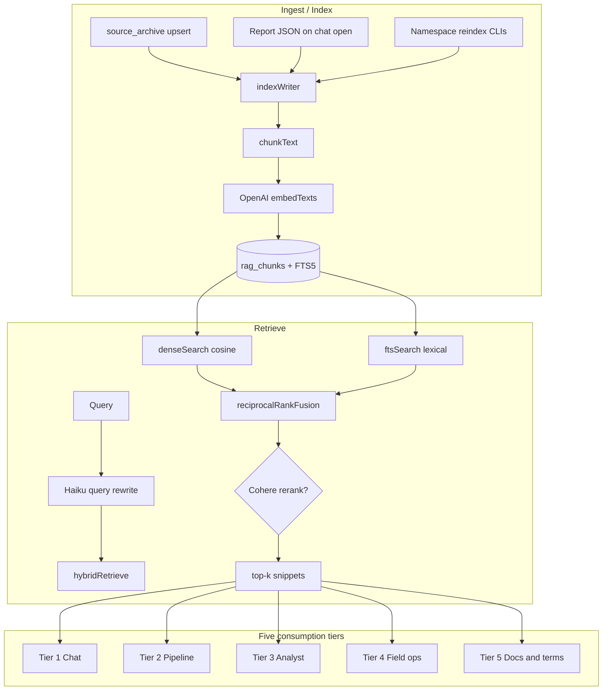
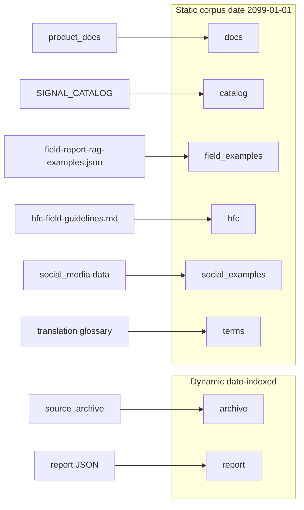
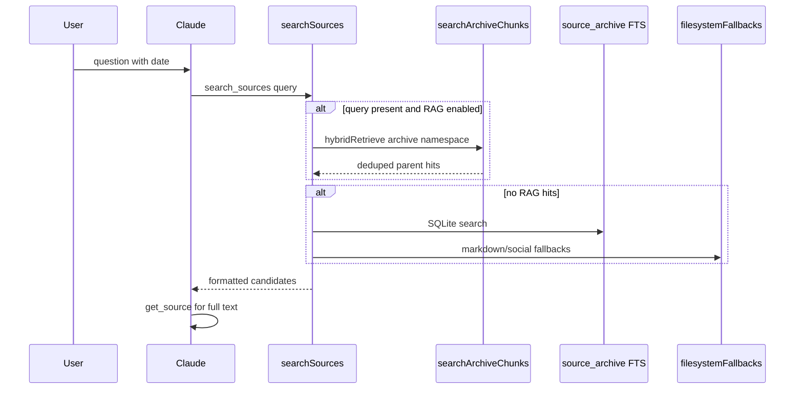
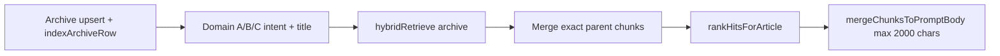

# RAG Platform — Canonical Reference

**Location:** `docs/main_docu_files/` (see [README](./README.md))

This document is the **exhaustive reference** for Retrieval-Augmented Generation (RAG) in this repository. It covers the unified hybrid-retrieval platform, all eight chunk namespaces, five consumption tiers, configuration, operations, evaluation, and recent changes.

For chat UX, streaming, and tool definitions, see [LLM_CHAT.md](./LLM_CHAT.md). For daily pipeline orchestration, see [pipeline.md](./pipeline.md).

---

## Table of contents

1. [Introduction and design principles](#1-introduction-and-design-principles)
2. [Platform architecture](#2-platform-architecture)
3. [Core platform (`cross-cut-modules/retrieval/`)](#3-core-platform-cross-cut-modulesretrieval)
4. [Embeddings layer (`cross-cut-modules/vector_index/`)](#4-embeddings-layer-cross-cut-modulesvector_index)
5. [Eight chunk namespaces](#5-eight-chunk-namespaces)
6. [Five consumption tiers](#6-five-consumption-tiers)
7. [Source archive integration and knowledge base lifecycle](#7-source-archive-integration-and-knowledge-base-lifecycle)
8. [Hexagonal port and application wiring](#8-hexagonal-port-and-application-wiring)
9. [Configuration reference](#9-configuration-reference)
10. [Operations playbook](#10-operations-playbook)
11. [Evaluation and regression](#11-evaluation-and-regression)
12. [Related embedding usage (not full RAG)](#12-related-embedding-usage-not-full-rag)
13. [What is NOT RAG](#13-what-is-not-rag)
14. [Recent improvements (May 29–30, 2026)](#14-recent-improvements-may-2930-2026)
15. [File index appendix](#15-file-index-appendix)

---

## 1. Introduction and design principles

### Purpose

The RAG platform provides **hybrid dense + lexical retrieval** over a Hebrew/English news and resilience corpus. It injects **top-k text snippets** into LLM prompts and tool responses so models can cite original sources without loading full documents into context.

### Key design decisions

| Principle | Implementation |
|-----------|----------------|
| **Single retrieval stack** | All RAG flows through [`cross-cut-modules/retrieval/`](../../cross-cut-modules/retrieval/). No Pinecone, Chroma, Qdrant, FAISS, Weaviate, or pgvector. |
| **SQLite storage** | Chunks live in `rag_chunks` + FTS5 virtual table `rag_chunks_fts` inside the shared app database (default `db/app.sqlite` via `SQLITE_PATH`). |
| **Hybrid search** | Dense cosine similarity (OpenAI embeddings) fused with FTS5 lexical search via Reciprocal Rank Fusion (RRF). |
| **Snippet-only injection** | Report JSON and scoring outputs remain **authoritative**. RAG returns snippets only — no multi-day originals dump, no parallel retrieval stack. |
| **Reference-only field context** | Field-channel RAG blocks are labeled reference-only; structured state and dialogue remain the source of truth for facts. |

### Storage path

As of May 30, 2026, the default SQLite path is **`db/app.sqlite`** (previously `data/app.sqlite`). Set `SQLITE_PATH` to override.

**Source archive code** (original full-text persistence, retention, filesystem fallbacks, ops CLIs) lives beside the database file:

| Path | Role |
|------|------|
| [`db/persistence/sourceArchiveStore.js`](../../db/persistence/sourceArchiveStore.js) | SQLite `source_archive` table |
| [`db/source_archive/`](../../db/source_archive/createSourceArchive.js) | Facade, IDs, `persistOriginalSources`, type-specific archivers |
| [`db/input/`](../../db/input/backfillSourceArchive.js) | `archive:backfill`, `archive:purge`, `rag:reindex`, `rag:eval` |

Legacy imports under `cross-cut-modules/persistence/` and `cross-cut-modules/source_archive/` re-export from `db/` for compatibility.

---

## 2. Platform architecture

### End-to-end flow



### Retrieval pipeline steps (`hybridRetrieve`)

Implemented in [`retrievalService.js`](../../cross-cut-modules/retrieval/retrievalService.js):

1. **Embed query** — `embedText(query)` via OpenAI; skipped when `VECTOR_INDEX_EMBEDDINGS=0` (FTS-only mode).
2. **Per-namespace candidate pools** — For each namespace in `filters.namespaces`, run `denseSearch` (if vector available) and `ftsSearch` in parallel within the date window.
3. **RRF merge** — Fuse dense + FTS hits per namespace, then merge across namespaces and sort by RRF score.
4. **Optional Cohere rerank** — Re-order top pool unless `skipRerank: true` (pipeline and most non-chat paths skip rerank).
5. **Post-filters** — Apply `parentId`, `sourceTypes`, and `scopeId` filters; return top `topKFinal` hits.

### Namespace / data-source map



---

## 3. Core platform (`cross-cut-modules/retrieval/`)

Entry point: [`createRetrievalService(opts)`](../../cross-cut-modules/retrieval/createRetrievalService.js) — requires `{ dbPath }`, optional `{ timezone }`.

Returns:

| Property | Role |
|----------|------|
| `retrieval` | Orchestrator (`hybridRetrieve`, `buildChatRetrievalHint`, `searchArchiveChunks`, …) |
| `indexWriter` | Ingest-time chunk + embed writer |
| `chunkStore` | SQLite chunk store |
| `storyClusterIndex` | Assess-time embedding dedup |
| `catalogIndexWriter`, `fieldExamplesIndexWriter`, `hfcGuidelinesIndexWriter`, `socialExamplesIndexWriter`, `docsIndexWriter`, `translationGlossaryIndexWriter` | Static namespace reindex helpers |
| `port` | `IRetrievalPort` adapter |
| `indexArchiveRow(row)` | Hook for `createSourceArchive` auto-indexing |
| `deleteEphemeralBeforeDate`, `rebuildFts` | Maintenance |

### Module reference

| Module | Exports / role |
|--------|----------------|
| [`chunkStore.js`](../../cross-cut-modules/retrieval/chunkStore.js) | `createChunkStore` — SQLite `rag_chunks` + `rag_chunks_fts`; `denseSearch`, `ftsSearch`, `upsertChunk`, `deleteByParentId`, `rebuildFts` |
| [`indexWriter.js`](../../cross-cut-modules/retrieval/indexWriter.js) | `createIndexWriter` — `indexArchiveRow`, `indexReport`, `reindexArchiveRows`, `indexChunksForParent` |
| [`chunkText.js`](../../cross-cut-modules/retrieval/chunkText.js) | `chunkText`, `buildChunkId`, `parseChunkId`, `splitParagraphs` |
| [`retrievalService.js`](../../cross-cut-modules/retrieval/retrievalService.js) | `createRetrievalOrchestrator` — main retrieve/format logic |
| [`hybridSearch.js`](../../cross-cut-modules/retrieval/hybridSearch.js) | `reciprocalRankFusion(denseHits, ftsHits, { k, topK })` |
| [`queryRewriter.js`](../../cross-cut-modules/retrieval/queryRewriter.js) | `rewriteQueryForRetrieval` — Haiku session-aware standalone query |
| [`cohereRerankAdapter.js`](../../cross-cut-modules/retrieval/cohereRerankAdapter.js) | `cohereRerank` — Cohere Rerank API; falls back to RRF order when no API key |
| [`ragConfig.js`](../../cross-cut-modules/retrieval/ragConfig.js) | All RAG env toggles and tunables |
| [`reportIndexHelpers.js`](../../cross-cut-modules/retrieval/reportIndexHelpers.js) | Maps report JSON → indexable signal/component/synthesis docs |
| [`domainIntentQueries.js`](../../cross-cut-modules/retrieval/domainIntentQueries.js) | Domain A/B/C intent strings for extract-time retrieval |
| [`index.js`](../../cross-cut-modules/retrieval/index.js) | Barrel export |

### Tier-specific retrieval helpers

| Module | Tier | Key functions |
|--------|------|---------------|
| [`pipelineRetrieval.js`](../../cross-cut-modules/retrieval/pipelineRetrieval.js) | 2 | `selectArticlePromptSpans`, `retrieveNarrativeGrounding`, `formatRetrievedSpansBlock` |
| [`analystRetrieval.js`](../../cross-cut-modules/retrieval/analystRetrieval.js) | 3 | `buildValidationReviewContext`, `retrieveSimilarArticles`, `retrieveCatalogNeighbors`, `retrievePboHistory` |
| [`fieldRetrieval.js`](../../cross-cut-modules/retrieval/fieldRetrieval.js) | 4 | `buildReportBuildRagContext`, `retrieveSimilarFieldReports`, `retrieveFieldTaxonomyExamples`, `retrieveHfcGuidelines`, `retrieveAudioSceneContext`, `retrieveSocialFewShotExamples` |
| [`docsRetrieval.js`](../../cross-cut-modules/retrieval/docsRetrieval.js) | 5 | `searchProductDocs` |
| [`translationTermRetrieval.js`](../../cross-cut-modules/retrieval/translationTermRetrieval.js) | 5 | `searchTranslationTerms`, `buildTranslationTermBlock` |

### Story clustering (assess-time dedup)

| Module | Role |
|--------|------|
| [`storyClusterIndex.js`](../../cross-cut-modules/retrieval/storyClusterIndex.js) | Assign/collapse story clusters by embedding similarity during assess |
| [`storyClusterStore.js`](../../cross-cut-modules/retrieval/storyClusterStore.js) | SQLite persistence for `rag_story_clusters` |

### `rag_chunks` schema

Defined in [`chunkStore.js`](../../cross-cut-modules/retrieval/chunkStore.js):

```sql
CREATE TABLE rag_chunks (
  chunk_id       TEXT PRIMARY KEY NOT NULL,
  namespace      TEXT NOT NULL,
  parent_id      TEXT NOT NULL,
  chunk_index    INTEGER NOT NULL,
  date           TEXT NOT NULL,
  source_type    TEXT,
  title          TEXT,
  source_url     TEXT,
  kind           TEXT NOT NULL DEFAULT 'original',
  scope_id       TEXT,
  chunk_text     TEXT NOT NULL,
  char_start     INTEGER,
  char_end       INTEGER,
  embedding      BLOB,
  dim            INTEGER,
  embed_model    TEXT,
  text_hash      TEXT NOT NULL,
  updated_at     TEXT NOT NULL DEFAULT (datetime('now'))
);

CREATE VIRTUAL TABLE rag_chunks_fts USING fts5(
  chunk_id UNINDEXED,
  chunk_text,
  title,
  tokenize='unicode61'
);
```

**Chunk ID format:** `{parentId}#c{chunkIndex}` — e.g. `archive:news:abc123#c0`. Built by `buildChunkId(parentId, chunkIndex)`.

**Embeddings:** Stored as BLOB (Float32Array) via [`vectorMath.js`](../../cross-cut-modules/vector_index/vectorMath.js). Cosine similarity computed in JavaScript at query time.

### Chunking

[`chunkText.js`](../../cross-cut-modules/retrieval/chunkText.js) implements paragraph-aware, Hebrew-friendly chunking:

- Default target: `RAG_CHUNK_TARGET_CHARS` (2000 chars)
- Overlap: `RAG_CHUNK_OVERLAP_RATIO` (0.15)
- Splits on paragraph boundaries first; falls back to sliding window with overlap for long paragraphs

### Index writer behavior

[`indexWriter.js`](../../cross-cut-modules/retrieval/indexWriter.js):

- **Archive rows:** `namespace=archive`, `parent_id=source_id`, body = `title + body`, `scope_id` from row.
- **Report JSON:** `namespace=report`, fingerprints per `{date}:{scope}` to skip redundant re-index. Indexes assessment summary, each component doc, and each signal doc.
- **Re-index:** Deletes all chunks for `parent_id` before inserting new ones (idempotent per parent).

### Orchestrator key methods

| Method | Purpose |
|--------|---------|
| `hybridRetrieve(query, filters)` | Core hybrid search; accepts namespaces, date window, scopeId, sourceType/sourceTypes, skipRerank, topKFinal, candidatePool |
| `retrieve(input)` | Chat-oriented wrapper: archive + report namespaces, scope from `reportGeoScope` |
| `buildChatRetrievalHint(input)` | Rewrite → retrieve → format system-context block; also calls `indexReport` on open |
| `searchArchiveChunks(input)` | Deduped parent-level hits for `search_sources` tool |
| `listArchiveChunksByParent(parentId)` | All chunks for a source (validation review) |
| `indexArchiveRow(row)` | Ingest hook (async, errors logged) |
| `rebuildFts()` | Rebuild FTS5 index from `rag_chunks` |

### Chat retrieval hint format

When hits exist, `buildChatRetrievalHint` returns:

```
RETRIEVED CONTEXT (hybrid search + rerank; cite source_id; use get_source for full text):
[1] source_id=… chunk=c0 (original, relevance=0.842) title="…"
    …snippet…
    url: …

Search query used: …
```

Snippet length controlled by `RAG_CONTEXT_SNIPPET_CHARS` (default 800).

---

## 4. Embeddings layer (`cross-cut-modules/vector_index/`)

This module provides the **embedding API only** — it is not a separate RAG stack.

| File | Role |
|------|------|
| [`openaiEmbeddingAdapter.js`](../../cross-cut-modules/vector_index/openaiEmbeddingAdapter.js) | `embedText`, `embedTexts`, `embeddingsEnabled`, `embeddingModelId` |
| [`vectorMath.js`](../../cross-cut-modules/vector_index/vectorMath.js) | `float32ToBuffer`, `bufferToFloat32`, `cosineSim` |
| [`vectorIndexStore.js`](../../cross-cut-modules/vector_index/vectorIndexStore.js) | Legacy `vector_documents` table — see [What is NOT RAG](#13-what-is-not-rag) |
| [`index.js`](../../cross-cut-modules/vector_index/index.js) | Barrel export |

### Embedding defaults

| Setting | Default |
|---------|---------|
| Model | `text-embedding-3-small` |
| Dimension hint | 1536 |
| API key | `OPENAI_API_KEY` or `RESILIENCE_EMBEDDING_API_KEY` |
| Endpoint | `https://api.openai.com/v1/embeddings` (override: `VECTOR_INDEX_OPENAI_EMBEDDINGS_URL`) |
| Batch size | 64 texts per request |
| Max input length | 8000 chars per text |

Set `VECTOR_INDEX_EMBEDDINGS=0` for FTS-only mode (used in CI when no API key).

---

## 5. Eight chunk namespaces

| Namespace | Index writer | Source corpus | `parent_id` pattern | Index date | Reindex command |
|-----------|-------------|---------------|---------------------|------------|-----------------|
| `archive` | `indexWriter.indexArchiveRow` | [`source_archive`](../../db/source_archive/createSourceArchive.js) — news, radio, field, whatsapp, social, PBO, Naftali, probes | `source_id` (e.g. `archive:news:…`, `md:path#1`) | Row date | Auto on upsert; `npm run rag:reindex` |
| `report` | `indexWriter.indexReport` | Assessment report JSON (signals, components, synthesis) | `report:{date}:{scope}:{docId}` | Assessment date | Auto on chat open |
| `docs` | [`docsIndexWriter.js`](../../cross-cut-modules/retrieval/docsIndexWriter.js) | `docs/product_docs/` (skips `api/generated/**`) | `docs:{slug}` | `2099-01-01` | `npm run rag:reindex-docs` |
| `catalog` | [`catalogIndexWriter.js`](../../cross-cut-modules/retrieval/catalogIndexWriter.js) | `SIGNAL_CATALOG` taxonomy | `catalog:{type}` | `2099-01-01` | `npm run rag:reindex-catalog` |
| `field_examples` | [`fieldExamplesIndexWriter.js`](../../cross-cut-modules/retrieval/fieldExamplesIndexWriter.js) | [`config/field-report-rag-examples.json`](../../config/field-report-rag-examples.json) + evidence requirements | Per example id | `2099-01-01` | `npm run rag:reindex-field-examples` |
| `hfc` | [`hfcGuidelinesIndexWriter.js`](../../cross-cut-modules/retrieval/hfcGuidelinesIndexWriter.js) | [`docs/corpora/hfc-field-guidelines.md`](../../docs/corpora/hfc-field-guidelines.md) | `hfc:guidelines` | `2099-01-01` | `npm run rag:reindex-hfc` |
| `social_examples` | [`socialExamplesIndexWriter.js`](../../cross-cut-modules/retrieval/socialExamplesIndexWriter.js) | `business_modules/social_media/data/` (keep/reject labeled rows) | Per example id | `2099-01-01` | `npm run rag:reindex-social-examples` |
| `terms` | [`translationGlossaryIndexWriter.js`](../../cross-cut-modules/retrieval/translationGlossaryIndexWriter.js) | [`config/resilience-translation-glossary.json`](../../config/resilience-translation-glossary.json) | Per term id | `2099-01-01` | `npm run rag:reindex-terms` |

Static namespaces use date `2099-01-01` so they are always within any retrieval date window when explicitly queried.

### Domain intent queries (extract RAG)

[`domainIntentQueries.js`](../../cross-cut-modules/retrieval/domainIntentQueries.js) defines A/B/C extraction pass intents:

| Domain | Intent query (abbreviated) |
|--------|---------------------------|
| A | Civilian protective behavior: shelter, compliance, evacuation, injuries, alerts |
| B | Institutional response: guidance, service continuity, leadership actions |
| C | Social fabric & wellbeing: volunteering, solidarity, morale, mental health, vulnerable groups |

Used by `selectArticlePromptSpans` as `{intent} {article title}`.

---

## 6. Five consumption tiers

### Tier 1 — Chat

**Purpose:** Ground the in-app report chat with hybrid retrieval hints and semantic `search_sources`.

| Item | Detail |
|------|--------|
| **Entry** | [`chatService.js`](../../business_modules/chat/app/chatService.js) → `buildRetrievalHint` → `retrieval.buildChatRetrievalHint` |
| **Tools** | [`sourceArchiveQuery.js`](../../business_modules/chat/domain/sourceArchiveQuery.js): `listSources`, `searchSources`, `getSource` |
| **Tool wiring** | [`claudeChat.js`](../../business_modules/chat/infrastructure/claudeChat.js) |
| **Route** | `POST /api/chat` via [`chatRoutes.js`](../../api/routes/chatRoutes.js) |
| **UI** | [`ChatPanel.jsx`](../../client/src/components/ChatPanel.jsx) (indirect) |

**Env flags:** `CHAT_RAG_ENABLED`, `CHAT_ARCHIVE_RAG_ENABLED` (both default on when `RAG_PIPELINE_ENABLED` is on).

**Retrieval params (chat hint):**

- Namespaces: `archive` (if `CHAT_ARCHIVE_RAG_ENABLED`) + `report`
- Rerank: **enabled** (Cohere when `COHERE_API_KEY` set)
- Query rewrite: Haiku via `rewriteQueryForRetrieval`
- Date window: `RAG_RETRIEVAL_DAYS` (default 14)
- Scope filter: `north` or `national` from `reportGeoScope`

**`search_sources` flow:**



When a text query is present, `searchSources` tries `searchArchiveChunks` first; on empty/error, falls back to archive FTS + [`filesystemFallbacks.js`](../../db/source_archive/filesystemFallbacks.js).

**Grounding flow:** System context receives retrieval hint → model uses `lookup_signals` / `search_sources` / `get_source` for drill-down.

---

### Tier 2 — Resilience pipeline

**Purpose:** Enrich extract and narrative prompts with archive spans; deduplicate cross-source stories at assess.

| Stage | Function | File |
|-------|----------|------|
| Extract spans | `selectArticlePromptSpans` | [`pipelineRetrieval.js`](../../cross-cut-modules/retrieval/pipelineRetrieval.js) |
| Narrative grounding | `retrieveNarrativeGrounding`, `formatRetrievedSpansBlock` | [`pipelineRetrieval.js`](../../cross-cut-modules/retrieval/pipelineRetrieval.js) |
| Narrative injection | `buildNarrativeRetrievalContext` | [`narrativeRetrievalContext.js`](../../business_modules/resilience/infrastructure/narrativeRetrievalContext.js) |
| Extract wiring | Archive upsert + RAG index | [`extract-signals.js`](../../business_modules/resilience/input/extract-signals.js) |
| Assess dedup | `storyClusterIndex` | [`assess-signals.js`](../../business_modules/resilience/input/assess-signals.js), [`assessSignalsHelpers.js`](../../business_modules/resilience/input/assessSignalsHelpers.js) |
| Haiku extract prompts | `selectArticlePromptSpans` call | [`claudeExtraction.js`](../../business_modules/resilience/infrastructure/claudeExtraction.js) |
| Sonnet/Haiku narratives | Retrieved spans block | [`claudeNarratives.js`](../../business_modules/resilience/infrastructure/claudeNarratives.js) |

**Env flags:** `RESILIENCE_EXTRACT_RAG_ENABLED`, `RESILIENCE_EXTRACT_RAG_DAYS`, `RESILIENCE_EXTRACT_SPANS_PER_ARTICLE` (default 6), `RESILIENCE_PIPELINE_RERANK` (default **0** — RRF only), `RESILIENCE_DEDUP_CLUSTER_ENABLED`, `RESILIENCE_DEDUP_CLUSTER_THRESHOLD` (default 0.93), `RESILIENCE_NARRATIVE_RAG_ENABLED`, `RESILIENCE_NARRATIVE_RAG_TOPK` (default 4).

**Extract span selection:**



- Falls back to keyword / inline semantic paragraphs when RAG returns nothing.
- `skipRerank: true`, `candidatePool: 40`.

**Story cluster dedup:** When enabled, `crossSourceDedupClustered` assigns `story_cluster_id` from embedding similarity (threshold 0.93) — avoids O(n²) pairwise comparison at assess.

---

### Tier 3 — Analyst workflow

**Purpose:** Support validation review, catalog gap analysis, and PBO historical search.

| Workflow | Function | Consumer |
|----------|----------|----------|
| Validation review context | `buildValidationReviewContext` | [`validationReviewService.js`](../../business_modules/resilience/validation/app/validationReviewService.js) |
| Haiku explain | Uses RAG context + metadata | [`validationReviewExplain.js`](../../business_modules/resilience/validation/app/validationReviewExplain.js) |
| Catalog gap neighbors | `retrieveCatalogNeighbors` | [`catalogLearningService.js`](../../business_modules/catalogLearning/app/catalogLearningService.js) |
| PBO history | `retrievePboHistory` | [`pboHistoricalSearchService.js`](../../business_modules/pbo_report_review/app/pboHistoricalSearchService.js) |

**API endpoints:**

| Endpoint | RAG payload |
|----------|-------------|
| `GET /api/validation/review-queue/:date/:scope/:articleKey/context` | `similar_articles`, `same_story`, `prior_decisions`, `oov_neighbors`, `article_chunks` |
| `POST /api/validation/review-queue/:date/:scope/:articleKey/explain` | Haiku answer grounded in chunks + reasons |
| `GET /api/pbo/historical-search?query=…` | PBO archive hybrid search |

**UI:** [`ValidationReviewPanel.jsx`](../../client/src/components/ValidationReviewPanel.jsx), [`useValidationReviewQueue.js`](../../client/src/hooks/useValidationReviewQueue.js).

**Env flags:** `VALIDATION_REVIEW_RAG_ENABLED`, `VALIDATION_EXPLAIN_ENABLED`, `CATALOG_LEARNING_RAG_ENABLED`, `CATALOG_RAG_TOPK` (5), `PBO_REVIEW_RAG_ENABLED`, `PBO_RAG_RETENTION_DAYS` (30).

All analyst retrieval paths use `skipRerank: true`.

---

### Tier 4 — Field channels & ops

**Purpose:** Inject reference-only context into field report build, audio contextualization, and social classification.

| Channel | Function | Consumer |
|---------|----------|----------|
| Report build / WhatsApp | `buildReportBuildRagContext` | [`reportBuildService.js`](../../business_modules/report_build/app/reportBuildService.js) |
| Report build routes | HTTP endpoints | [`reportBuildRoutes.js`](../../business_modules/report_build/input/reportBuildRoutes.js) |
| Audio contextualizer | `retrieveAudioSceneContext` | [`audioTranscriptContextualizer.js`](../../business_modules/audio/app/audioTranscriptContextualizer.js) |
| Social classify | `retrieveSocialFewShotExamples` | [`socialCandidateClassifier.js`](../../business_modules/social_media/app/socialCandidateClassifier.js) |
| Social gather | Passes retrieval to classifier | [`socialMediaDailyGatherService.js`](../../business_modules/social_media/app/socialMediaDailyGatherService.js) |

**Report build modes:**

- **`analyze`:** Taxonomy examples + HFC guidelines only (no similar reports).
- **`draft`:** Adds similar approved `field` / `whatsapp` / `manual` archive reports.

**Env flags:** `REPORT_BUILD_RAG_ENABLED`, `REPORT_BUILD_RAG_DAYS` (30), `REPORT_BUILD_RAG_TOPK` (4), `AUDIO_CONTEXTUALIZER_RAG_ENABLED`, `AUDIO_SCENE_RAG_TOPK` (5), `SOCIAL_CLASSIFY_RAG_ENABLED`, `SOCIAL_CLASSIFY_RAG_TOPK` (6), `SOCIAL_EXAMPLES_AUTO_REINDEX` (off; set `1` on gather-daily).

**Disclaimer injected:** `REFERENCE ONLY — do not add facts, names, localities, or numbers not present in structured state or dialogue.`

**Archive sources for field RAG:** `visitsInput` indexes field rows; WhatsApp submit uses `source_label: field_whatsapp`; web report-build confirm archives as `field` / `report_build-web`.

---

### Tier 5 — Product docs & translation

**Purpose:** In-app operator help and optional translation glossary lookup.

| Surface | Function | File |
|---------|----------|------|
| Docs panel search | `searchProductDocs` | [`docsRetrieval.js`](../../cross-cut-modules/retrieval/docsRetrieval.js) |
| Docs API | `GET /api/docs/search?query=…` | [`docsRoutes.js`](../../api/routes/docsRoutes.js) |
| Docs UI | Debounced search, "Suggested topics" | [`DocsPanel.jsx`](../../client/src/components/DocsPanel.jsx) |
| Translation glossary | `buildTranslationTermBlock` | [`translationTermRetrieval.js`](../../cross-cut-modules/retrieval/translationTermRetrieval.js) |

**Env flags:** `DOCS_RAG_ENABLED`, `DOCS_RAG_TOPK` (6), `DOCS_RAG_VERSION` (corpus `scopeId` on chunks), `TRANSLATION_TERM_RAG_ENABLED` (**default off**).

Docs search filters gated content unless `includeGated: true`. Client-side index filter remains as fallback when RAG is off or returns no hits.

**Ops:** Run `npm run rag:reindex-docs` after `npm run docs:sync` on deploy.

---

## 7. Source archive integration and knowledge base lifecycle

### Auto-index on upsert

[`createSourceArchive.js`](../../db/source_archive/createSourceArchive.js) accepts `retrievalIndexer` (the `createRetrievalService` return value). Every `upsert` schedules `indexArchiveRow` asynchronously.

Wired in [`app.js`](../../app.js):

```javascript
const retrievalService = createRetrievalService({ dbPath: sqlitePath, timezone: articleTimezone });
const sourceArchive = createSourceArchive(sqlitePath, { retrievalIndexer: retrievalService });
```

### Backfill CLI (added May 30, 2026)

[`backfillSourceArchive.js`](../../db/input/backfillSourceArchive.js):

```bash
npm run archive:backfill -- --days 14
npm run archive:backfill -- --days 14 --no-reindex-rag   # skip chunk indexing
```

Idempotently backfills `source_archive` from:

- `evidence_items` (legacy DB bridge)
- Markdown exports (news, field, whatsapp, radio)
- Social signal bundles
- Connectivity probe records

Each upsert triggers RAG indexing unless `--no-reindex-rag`.

### Reindex archive chunks

```bash
npm run rag:reindex -- --days 14
```

Script: [`reindexRag.js`](../../db/input/reindexRag.js).

### Purge and fallbacks

```bash
npm run archive:purge
```

- Removes ephemeral SQLite rows (`news`, `radio`, `social` older than 14 days) and associated RAG chunks.
- **Permanent in SQLite:** field, pbo, naftali, probe, whatsapp, manual, video, etc.
- **Filesystem:** never deleted by purge.

When SQLite rows are purged, chat tools still find content via [`filesystemFallbacks.js`](../../db/source_archive/filesystemFallbacks.js) (refactored May 30, 2026 with safer `enumerateDates` and extracted `rowMatchesQuery` / `collectCandidatesForDate`).

### Stable source IDs

| Pattern | Example |
|---------|---------|
| Archive hash | `archive:{source_type}:{hash}` |
| Markdown | `md:{relativePath}#{articleIndex}` |
| Legacy DB | `db:evidence_items:{id}` |

---

## 8. Hexagonal port and application wiring

### Port interface

[`IRetrievalPort.js`](../../cross-cut-modules/retrieval/domain/ports/IRetrievalPort.js):

| Method | Description |
|--------|-------------|
| `hybridRetrieve(query, filters?)` | Core hybrid search |
| `searchArchiveChunks(opts)` | Deduped archive search for tools |
| `indexArchiveRow(row)` | Ingest hook |
| `rebuildFts()` | Rebuild FTS5 |
| `deleteEphemeralBeforeDate(cutoff, types?)` | Ephemeral chunk cleanup |

Adapter: [`retrievalPortAdapter.js`](../../cross-cut-modules/retrieval/infrastructure/retrievalPortAdapter.js).

### `app.js` consumers

`retrievalService` is passed to:

- Chat routes (`POST /api/chat`)
- Docs routes (`GET /api/docs/search`)
- Validation review service
- Report build service
- Translation service (optional term RAG)
- Social media gather/classifier
- Audio contextualizer (via CLI)
- Catalog learning gap report
- PBO historical search

Access pattern: `retrievalService.retrieval` for orchestrator methods; `retrievalService.port` for port facade.

---

## 9. Configuration reference

All RAG toggles live in [`ragConfig.js`](../../cross-cut-modules/retrieval/ragConfig.js). Per-tier flags inherit from `RAG_PIPELINE_ENABLED` when unset (explicit `0` disables, `1` forces on).

### Global / platform

| Variable | Default | Role |
|----------|---------|------|
| `RAG_PIPELINE_ENABLED` | on (`!== '0'`) | Master switch |
| `RAG_RETRIEVAL_DAYS` | 14 | Default date window |
| `RAG_CHUNK_TARGET_CHARS` | 2000 | Chunk size |
| `RAG_CHUNK_OVERLAP_RATIO` | 0.15 | Overlap ratio |
| `RAG_HYBRID_CANDIDATES` | 50 | Candidate pool before rerank |
| `RAG_FINAL_TOPK` | 8 | Final hits (chat) |
| `RAG_RRF_K` | 60 | RRF constant |
| `RAG_CONTEXT_SNIPPET_CHARS` | 800 | Snippet length in prompts |
| `RAG_QUERY_REWRITE_ENABLED` | on | Haiku query rewrite |
| `SQLITE_PATH` | `db/app.sqlite` | Database path |
| `TZ_ARTICLES` | `Asia/Jerusalem` | Date window timezone |

### Embeddings

| Variable | Default | Role |
|----------|---------|------|
| `OPENAI_API_KEY` / `RESILIENCE_EMBEDDING_API_KEY` | — | Embedding API key |
| `VECTOR_INDEX_EMBEDDINGS` | on | Set `0` for FTS-only (CI) |
| `VECTOR_INDEX_EMBED_MODEL` / `RESILIENCE_EMBEDDING_MODEL` | `text-embedding-3-small` | Model id |
| `VECTOR_INDEX_OPENAI_EMBEDDINGS_URL` | OpenAI default | Override endpoint |

### Rerank

| Variable | Default | Role |
|----------|---------|------|
| `COHERE_API_KEY` | — | Enables Cohere rerank |
| `RAG_COHERE_RERANK_MODEL` | `rerank-v3.5` | Rerank model |

### Tier 1 — Chat

| Variable | Default |
|----------|---------|
| `CHAT_RAG_ENABLED` | on |
| `CHAT_ARCHIVE_RAG_ENABLED` | on |

### Tier 2 — Pipeline

| Variable | Default |
|----------|---------|
| `RESILIENCE_EXTRACT_RAG_ENABLED` | follows `RAG_PIPELINE_ENABLED` |
| `RESILIENCE_EXTRACT_RAG_DAYS` | follows `RAG_RETRIEVAL_DAYS` |
| `RESILIENCE_EXTRACT_SPANS_PER_ARTICLE` | 6 |
| `RESILIENCE_PIPELINE_RERANK` | **0** (RRF only) |
| `RESILIENCE_DEDUP_CLUSTER_ENABLED` | follows embeddings |
| `RESILIENCE_DEDUP_CLUSTER_THRESHOLD` | 0.93 |
| `RESILIENCE_NARRATIVE_RAG_ENABLED` | follows pipeline |
| `RESILIENCE_NARRATIVE_RAG_TOPK` | 4 |

### Tier 3 — Analyst

| Variable | Default |
|----------|---------|
| `VALIDATION_REVIEW_RAG_ENABLED` | follows pipeline |
| `VALIDATION_EXPLAIN_ENABLED` | follows validation RAG |
| `CATALOG_LEARNING_RAG_ENABLED` | follows pipeline |
| `CATALOG_RAG_TOPK` | 5 |
| `PBO_REVIEW_RAG_ENABLED` | follows pipeline |
| `PBO_RAG_RETENTION_DAYS` | 30 |

### Tier 4 — Field ops

| Variable | Default |
|----------|---------|
| `REPORT_BUILD_RAG_ENABLED` | follows pipeline |
| `REPORT_BUILD_RAG_DAYS` | 30 |
| `REPORT_BUILD_RAG_TOPK` | 4 |
| `AUDIO_CONTEXTUALIZER_RAG_ENABLED` | follows pipeline |
| `AUDIO_SCENE_RAG_TOPK` | 5 |
| `SOCIAL_CLASSIFY_RAG_ENABLED` | follows pipeline |
| `SOCIAL_CLASSIFY_RAG_TOPK` | 6 |
| `SOCIAL_EXAMPLES_AUTO_REINDEX` | off |

### Tier 5 — Docs & translation

| Variable | Default |
|----------|---------|
| `DOCS_RAG_ENABLED` | follows pipeline |
| `DOCS_RAG_TOPK` | 6 |
| `DOCS_RAG_VERSION` | corpus scopeId on chunks |
| `TRANSLATION_TERM_RAG_ENABLED` | **off** |

---

## 10. Operations playbook

### npm scripts

| Script | Command | Purpose |
|--------|---------|---------|
| `archive:backfill` | `npm run archive:backfill -- --days 14` | Backfill source_archive (+ RAG index by default) |
| `archive:purge` | `npm run archive:purge` | Purge ephemeral archive rows + chunks |
| `rag:reindex` | `npm run rag:reindex -- --days 14` | Reindex archive namespace |
| `rag:reindex-catalog` | `npm run rag:reindex-catalog` | Reindex signal catalog |
| `rag:reindex-field-examples` | `npm run rag:reindex-field-examples` | Reindex field taxonomy examples |
| `rag:reindex-hfc` | `npm run rag:reindex-hfc` | Reindex HFC guidelines |
| `rag:reindex-social-examples` | `npm run rag:reindex-social-examples` | Reindex social few-shot corpus |
| `rag:reindex-docs` | `npm run rag:reindex-docs` | Reindex product docs |
| `rag:reindex-terms` | `npm run rag:reindex-terms` | Reindex translation glossary |
| `rag:eval` | `npm run rag:eval` | Fixture-driven regression suite |

### Deploy / rollout checklist

1. Ensure `OPENAI_API_KEY` (and optionally `COHERE_API_KEY`, `ANTHROPIC_API_KEY` for rewrite) are set.
2. Run `npm run archive:backfill -- --days 14` to populate source archive.
3. Run `npm run rag:reindex -- --days 14` for archive chunks.
4. Run static namespace reindex commands as needed (`rag:reindex-catalog`, `rag:reindex-docs`, etc.).
5. Run `npm run rag:eval` and confirm PASS for archive + docs fixtures.
6. Enable tier-specific flags on staging before production (`VALIDATION_REVIEW_RAG_ENABLED`, etc.).

### Maintenance operations

| Operation | How |
|-----------|-----|
| Rebuild FTS5 | `retrievalService.rebuildFts()` or via reindex CLI (calls rebuild after bulk insert) |
| Ephemeral chunk cleanup | `retrievalService.deleteEphemeralBeforeDate(cutoff, types)` — coordinated with archive purge |
| FTS-only dev/CI | `VECTOR_INDEX_EMBEDDINGS=0` — lexical search only, no embedding API calls |

### Troubleshooting

| Symptom | Likely cause | Fix |
|---------|--------------|-----|
| Empty chat retrieval hints | `RAG_PIPELINE_ENABLED=0`, missing API key, or empty index | Check env; run backfill + reindex |
| `search_sources` returns nothing | Purged SQLite rows, no filesystem fallback | Run backfill; verify date range |
| Rerank not applied | No `COHERE_API_KEY` | Expected — RRF order used; log: "skipping rerank" |
| Pipeline spans empty | `RESILIENCE_EXTRACT_RAG_ENABLED=0` or article not indexed | Verify extract archives + indexes on upsert |
| Docs search empty | Docs not reindexed after deploy | `npm run docs:sync && npm run rag:reindex-docs` |
| CI failures on RAG tests | Missing embedding key | CI sets `VECTOR_INDEX_EMBEDDINGS=0` — tests use FTS path |

---

## 11. Evaluation and regression

### Eval runner

[`ragEval.js`](../../db/input/ragEval.js):

```bash
npm run rag:eval
```

Runs fixture-driven suites:

| Fixture | Path | Scope |
|---------|------|-------|
| Archive (Hebrew) | `tests/fixtures/rag-golden.he.json` | Archive hybrid retrieve |
| North scope | `tests/fixtures/rag-golden-north.json` | Scope filtering |
| Docs | `tests/fixtures/rag-golden-docs.json` | Product docs namespace |
| Fallback | `tests/fixtures/rag-golden-fallback.json` | Documented SKIP (filesystem-only) |

### Unit / integration tests

Under `tests/cross-cut-modules/retrieval/`:

- `chunkStore.test.js`, `chunkText.test.js`, `hybridSearch.test.js`
- `retrievalService.test.js`, `pipelineRetrieval.test.js`
- `analystRetrieval.test.js`, `fieldRetrieval.test.js`, `docsRetrieval.test.js`
- `queryRewriter.test.js`, `storyClusterIndex.test.js`

Additional consumer tests:

- `tests/api/docsRoutes.search.test.js`
- `tests/business_modules/resilience/validation/input/validationReviewRoutes.test.js`
- `tests/business_modules/pbo_report_review/pboHistoricalSearch.test.js`
- `tests/business_modules/social_media/app/socialCandidateClassifier.test.js`
- `tests/business_modules/report_build/app/reportBuildService.test.js`
- `tests/business_modules/catalogLearning/catalogLearning.test.js`

---

## 12. Related embedding usage (not full RAG)

These use embeddings but **do not** go through the `rag_chunks` index:

| Module | Purpose | Env |
|--------|---------|-----|
| [`embeddingEvidenceVerifier.js`](../../business_modules/resilience/infrastructure/embeddingEvidenceVerifier.js) | Optional N8 cosine "rescue" when evidence containment check fails | `RESILIENCE_EMBEDDING_VERIFY=1` |
| | Skip rescue for high-stakes types (`direct_quote_named_person`, etc.) | `RESILIENCE_EMBEDDING_SKIP_TYPES` |
| [`oovBurstAlert.js`](../../business_modules/resilience/domain/services/oovBurstAlert.js) | OOV burst detection embedding similarity | — |
| [`catalogLearningService.js`](../../business_modules/catalogLearning/app/catalogLearningService.js) | Direct `embedText` for gap clustering (separate from catalog namespace RAG) | — |
| [`assessSignalsHelpers.js`](../../business_modules/resilience/input/assessSignalsHelpers.js) | Story cluster vectors at assess | `RESILIENCE_DEDUP_CLUSTER_*` |
| [`claudeExtraction.js`](../../business_modules/resilience/infrastructure/claudeExtraction.js) | Inline semantic paragraph fallback when RAG spans empty | — |

---

## 13. What is NOT RAG

### Legacy `vectorIndexStore`

[`vectorIndexStore.js`](../../cross-cut-modules/vector_index/vectorIndexStore.js) maintains a separate `vector_documents` table. It is still instantiated in [`app.js`](../../app.js) and passed to [`chatRoutes.js`](../../api/routes/chatRoutes.js), but **chat no longer uses it**.

All chat RAG now flows through:

- `retrievalService.retrieval.buildChatRetrievalHint`
- `retrievalService.retrieval.searchArchiveChunks`

The May 29 migration replaced an earlier `vectorIndexStore.querySimilar`-based chat path with the unified `rag_chunks` platform.

### No external vector databases

This repo does not integrate Pinecone, Chroma, Qdrant, FAISS, Weaviate, or pgvector. All retrieval is local SQLite + in-process cosine similarity.

---

## 14. Recent improvements (May 29–30, 2026)

### May 30 — commit `6cabdc7`

**Production security hardening, agentic chat, and GCP/Cloudflare cutover ops.**

RAG-relevant changes:

| Change | Impact on RAG |
|--------|---------------|
| **Session-based chat** | Chat history no longer sent in POST body; RAG hint still injected per turn via `buildChatRetrievalHint` |
| **`costlyRoutePreHandlers`** | `POST /api/chat`, validation explain/agent, report-build, and `GET /api/docs/search`: auth → optional App Check → daily HTTP budget (see [COST_CONTROLS.md](./COST_CONTROLS.md)) |
| **Chat retrieval cache** | `CHAT_RETRIEVAL_CACHE_TTL_MS` — one hybrid search per session/query can serve system hint + `search_sources` tool |
| **Validation RAG cache** | `VALIDATION_RAG_CACHE_TTL_MS` — caches `buildValidationReviewContext` per queue item |
| **Analyst chat tools** | Validation/catalog/geo tools reuse same `rag_chunks` indexes as panel workflows |
| **Security audit trail** | `agent.tool_round` + chat confirm events logged via `auditLog.js` |

### May 30 — commit `8e15f03`

**Reorganize persistence path, scripts layout, and module data locations.**

RAG-relevant changes (no changes to core `cross-cut-modules/retrieval/` logic):

| Change | Impact on RAG |
|--------|---------------|
| SQLite default `data/` → `db/` | `SQLITE_PATH` default is now `db/app.sqlite`; `rag_chunks` lives in same DB |
| **New [`backfillSourceArchive.js`](../../db/input/backfillSourceArchive.js)** | Idempotent CLI to populate `source_archive` from evidence DB, markdown exports, social bundles, probes — feeds the archive RAG corpus; triggers chunk index on each upsert |
| **[`filesystemFallbacks.js`](../../db/source_archive/filesystemFallbacks.js) refactor** | Safer date iteration (`enumerateDates`); extracted `rowMatchesQuery` / `collectCandidatesForDate` — used when SQLite archive rows are purged but chat tools still need retrieval |
| **[`chatService.js`](../../business_modules/chat/app/chatService.js) bugfix** | Removed orphaned duplicate code block after report indexing path |
| **[`purgeSourceArchive.js`](../../db/input/purgeSourceArchive.js)** | Updated default SQLite path to `db/app.sqlite` |

### May 29 — commits `ef18d69`, `ef51e4b`

| Change | Impact on RAG |
|--------|---------------|
| Unified **[`sourceArchiveQuery.js`](../../business_modules/chat/domain/sourceArchiveQuery.js)** | `search_sources` tries RAG-first via `searchArchiveChunks`, then archive FTS + filesystem fallback |
| Chat tools renamed | Evidence-centric → archive-centric: `search_sources`, `get_source`, `list_sources` |
| Expanded source archive coverage | Social, PBO municipal/regional, Naftali, connectivity probes — all auto-indexed into `archive` namespace |
| Chat retrieval migration | `retrievalService.buildChatRetrievalHint` replaces earlier `vectorIndexStore`-based indexing |
| **`embeddingEvidenceVerifier`** | `isEmbeddingRescueSkippedForType` — skip embedding cosine rescue for high-stakes evidence types |
| Pipeline SQLite path updates | `extract-signals.js`, `assess-signals.js` default paths aligned with new layout |

---

## 15. File index appendix

### Core platform

| File | Role |
|------|------|
| `cross-cut-modules/retrieval/createRetrievalService.js` | Factory |
| `cross-cut-modules/retrieval/chunkStore.js` | SQLite store + search |
| `cross-cut-modules/retrieval/indexWriter.js` | Ingest indexer |
| `cross-cut-modules/retrieval/chunkText.js` | Chunking |
| `cross-cut-modules/retrieval/retrievalService.js` | Orchestrator |
| `cross-cut-modules/retrieval/hybridSearch.js` | RRF |
| `cross-cut-modules/retrieval/queryRewriter.js` | Query rewrite |
| `cross-cut-modules/retrieval/cohereRerankAdapter.js` | Cohere rerank |
| `cross-cut-modules/retrieval/ragConfig.js` | Env config |
| `cross-cut-modules/retrieval/reportIndexHelpers.js` | Report → docs |
| `cross-cut-modules/retrieval/domainIntentQueries.js` | Extract intents |
| `cross-cut-modules/retrieval/storyClusterIndex.js` | Story dedup |
| `cross-cut-modules/retrieval/storyClusterStore.js` | Cluster persistence |
| `cross-cut-modules/retrieval/index.js` | Barrel |

### Tier helpers

| File | Tier |
|------|------|
| `cross-cut-modules/retrieval/pipelineRetrieval.js` | 2 |
| `cross-cut-modules/retrieval/analystRetrieval.js` | 3 |
| `cross-cut-modules/retrieval/fieldRetrieval.js` | 4 |
| `cross-cut-modules/retrieval/docsRetrieval.js` | 5 |
| `cross-cut-modules/retrieval/translationTermRetrieval.js` | 5 |

### Namespace index writers

| File | Namespace |
|------|-----------|
| `cross-cut-modules/retrieval/catalogIndexWriter.js` | `catalog` |
| `cross-cut-modules/retrieval/docsIndexWriter.js` | `docs` |
| `cross-cut-modules/retrieval/fieldExamplesIndexWriter.js` | `field_examples` |
| `cross-cut-modules/retrieval/hfcGuidelinesIndexWriter.js` | `hfc` |
| `cross-cut-modules/retrieval/socialExamplesIndexWriter.js` | `social_examples` |
| `cross-cut-modules/retrieval/translationGlossaryIndexWriter.js` | `terms` |

### Reindex CLIs

| File | npm script |
|------|------------|
| `db/input/reindexRag.js` | `rag:reindex` |
| `business_modules/catalogLearning/input/reindex-catalog.js` | `rag:reindex-catalog` |
| `business_modules/report_build/input/reindex-field-examples.js` | `rag:reindex-field-examples` |
| `cross-cut-modules/retrieval/input/reindex-hfc.js` | `rag:reindex-hfc` |
| `business_modules/social_media/input/reindex-social-examples.js` | `rag:reindex-social-examples` |
| `cross-cut-modules/retrieval/input/reindex-docs.js` | `rag:reindex-docs` |
| `cross-cut-modules/retrieval/input/reindex-terms.js` | `rag:reindex-terms` |
| `db/input/ragEval.js` | `rag:eval` |
| `db/input/backfillSourceArchive.js` | `archive:backfill` |

### Port / infrastructure

| File | Role |
|------|------|
| `cross-cut-modules/retrieval/domain/ports/IRetrievalPort.js` | Port interface |
| `cross-cut-modules/retrieval/infrastructure/retrievalPortAdapter.js` | Adapter |
| `db/source_archive/createSourceArchive.js` | Auto-index hook |
| `db/source_archive/filesystemFallbacks.js` | Purge fallbacks |
| `cross-cut-modules/vector_index/openaiEmbeddingAdapter.js` | Embeddings |
| `cross-cut-modules/vector_index/vectorMath.js` | Vector math |

### Tier 1 — Chat consumers

| File | Role |
|------|------|
| `business_modules/chat/app/chatService.js` | Retrieval hint injection |
| `business_modules/chat/domain/sourceArchiveQuery.js` | Tool handlers |
| `business_modules/chat/infrastructure/claudeChat.js` | Tool definitions |
| `api/routes/chatRoutes.js` | HTTP route |
| `client/src/components/ChatPanel.jsx` | UI |

### Tier 2 — Pipeline consumers

| File | Role |
|------|------|
| `business_modules/resilience/input/extract-signals.js` | Archive + index |
| `business_modules/resilience/input/assess-signals.js` | Story clusters |
| `business_modules/resilience/input/assessSignalsHelpers.js` | Cluster collapse |
| `business_modules/resilience/infrastructure/claudeExtraction.js` | Extract spans |
| `business_modules/resilience/infrastructure/claudeNarratives.js` | Narrative spans |
| `business_modules/resilience/infrastructure/narrativeRetrievalContext.js` | Narrative context builder |

### Tier 3 — Analyst consumers

| File | Role |
|------|------|
| `business_modules/resilience/validation/app/validationReviewService.js` | Review context |
| `business_modules/resilience/validation/app/validationReviewExplain.js` | Haiku explain |
| `business_modules/resilience/validation/input/validationReviewRoutes.js` | API routes |
| `business_modules/catalogLearning/app/catalogLearningService.js` | Gap report neighbors |
| `business_modules/catalogLearning/input/generate-gap-report.js` | Gap report CLI |
| `business_modules/pbo_report_review/app/pboHistoricalSearchService.js` | PBO search |
| `business_modules/pbo_report_review/input/runMunicipalPboReview.js` | PBO review CLI |
| `client/src/components/ValidationReviewPanel.jsx` | Analyst UI |

### Tier 4 — Field consumers

| File | Role |
|------|------|
| `business_modules/report_build/app/reportBuildService.js` | Report build RAG |
| `business_modules/report_build/input/reportBuildRoutes.js` | HTTP routes |
| `business_modules/audio/app/audioTranscriptContextualizer.js` | Radio scenes |
| `business_modules/social_media/app/socialCandidateClassifier.js` | Social few-shot |
| `business_modules/social_media/app/socialMediaDailyGatherService.js` | Gather pipeline |
| `business_modules/social_media/input/socialMediaInput.js` | Auto-reindex option |

### Tier 5 — Docs & translation consumers

| File | Role |
|------|------|
| `api/routes/docsRoutes.js` | Docs search API |
| `client/src/components/DocsPanel.jsx` | Docs UI |
| `business_modules/translation/app/translationService.js` | Term glossary |

### Config / fixtures

| File | Role |
|------|------|
| `config/field-report-rag-examples.json` | Field taxonomy examples |
| `config/resilience-translation-glossary.json` | Translation terms |
| `tests/fixtures/rag-golden.he.json` | Archive eval |
| `tests/fixtures/rag-golden-north.json` | North scope eval |
| `tests/fixtures/rag-golden-docs.json` | Docs eval |
| `tests/fixtures/rag-golden-fallback.json` | Fallback (SKIP) |

### Related documentation

| File | Role |
|------|------|
| [LLM_CHAT.md](./LLM_CHAT.md) | Chat UX, streaming, tools |
| [pipeline.md](./pipeline.md) | Daily pipeline operations |
| [docs/product_docs/troubleshooting/in-app-and-full-docs.md](../product_docs/troubleshooting/in-app-and-full-docs.md) | Docs panel ops |
| [.github/CI-SETUP.md](../../.github/CI-SETUP.md) | CI embedding keys |

---

*Last updated: 2026-05-30 — reflects commits `6cabdc7`, `8e15f03`, and May 29 archive/chat RAG migration.*
