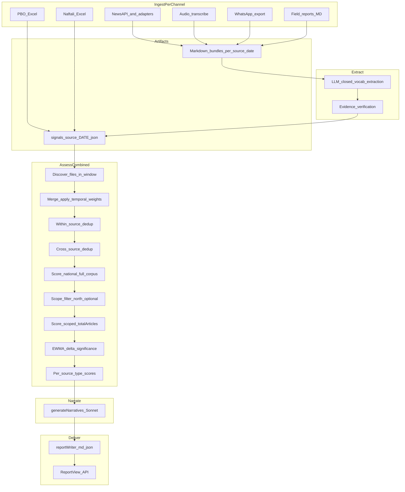

# Eight-Component Community Resilience Pipeline — NotebookLM Review Document

## Document charter

**Purpose.** This document is a **standalone, retrieval-optimized narrative** of how the Population Resilience Monitor turns **heterogeneous observational inputs** into **eight Pikud HaOref–aligned component scores** and a single **overall resilience score**. It is written for uploading to **[NotebookLM](https://notebooklm.google.com)** (or similar RAG notebooks): headings are stable, sections repeat *inputs → process → outputs → code location*, and tables carry facts that chunk well for question answering.

**Relationship to the canonical reference.** Exhaustive implementation detail (per-component essays, full prompt rules, QA harness, API tables) lives in:

- [docs/main_docu_files/RESILIENCE-ENGINE-REFERENCE.md](../main_docu_files/RESILIENCE-ENGINE-REFERENCE.md)
- [docs/main_docu_files/SYSTEM-AND-OPERATOR-MODEL.md](../main_docu_files/SYSTEM-AND-OPERATOR-MODEL.md)

Use this NotebookLM file for **end-to-end flow, definitions, and study-style Q&A**; use the canonical doc when you need **line-level spec parity** with the codebase.

**Primary audiences.**

| Audience | How to use this file |
|----------|----------------------|
| Analysts / officers | Sections 2–3, 5–6, 9–10 — what scores mean and how to read uncertainty |
| Engineers | Sections 4–8, 11 — implementation traceability |
| NotebookLM workflows | Section 12 (study prompts) + glossary — paste as source instructions or flashcards |

**How to use this file in NotebookLM**

1. Upload **this file** as a source; optionally add [RESILIENCE-ENGINE-REFERENCE.md](../main_docu_files/RESILIENCE-ENGINE-REFERENCE.md) and [SYSTEM-AND-OPERATOR-MODEL.md](../main_docu_files/SYSTEM-AND-OPERATOR-MODEL.md) for deeper follow-up.
2. In notebook instructions, ask the model to **cite section numbers** and to treat **deterministic scoring** (code) as authoritative over natural-language paraphrases.
3. For “where is X implemented?”, rely on **Section 11 (traceability)** first.

**Version note.** Descriptions match the repository layout under `business_modules/resilience/` and the batch CLI `assess-signals.js` as of the document’s authoring; if behavior diverges, the linked source files win.

**Phase 1 scope (2026).** Only **`national`** and **`north`** report scopes are supported for population-behavior officers and analysts. North is the sole regional slice until a generic district model replaces hardcoded `regionSignalFilter` logic. Reports include `assessment.methodology` (scope-decision telemetry, epistemic disclaimers, advisory tuning proposals).

---

## Table of contents

1. [Executive synthesis](#1-executive-synthesis)
2. [End-to-end flow (diagram)](#2-end-to-end-flow-diagram)
3. [The eight components (compact reference)](#3-the-eight-components-compact-reference)
4. [Data sources and artifacts](#4-data-sources-and-artifacts)
5. [Combining sources in the assessment window](#5-combining-sources-in-the-assessment-window)
6. [The signal record (cross-channel lingua franca)](#6-the-signal-record-cross-channel-lingua-franca)
7. [Deterministic scoring: from signals to 1–10](#7-deterministic-scoring-from-signals-to-110)
8. [From eight component scores to overall resilience score](#8-from-eight-component-scores-to-overall-resilience-score)
9. [Reliability instruments (reader-oriented)](#9-reliability-instruments-reader-oriented)
10. [Narratives, Norris lens, reports, and UI](#10-narratives-norris-lens-reports-and-ui)
11. [Traceability: stage → files → artifacts](#11-traceability-stage--files--artifacts)
12. [Glossary](#12-glossary)
13. [NotebookLM study prompts](#13-notebooklm-study-prompts)
14. [Limitations and disclaimer pointer](#14-limitations-and-disclaimer-pointer)

---

## 1. Executive synthesis

**What the system produces.** For a chosen **report date**, **assessment window** (1–3 prior calendar days), and **scope** (`national` or `north`), the pipeline produces:

- Eight **component scores** on a discrete **1–10** scale (or null with `insufficient_data`).
- Per component: evidence mass, polarity balance, **certainty**, a **confidence band** (`low | medium | high`), **bootstrap 90% interval**, **counterfactual sensitivity**, optional **facet** sub-scores, and (after batch enrichment) **EWMA smoothed score**, **delta vs yesterday**, and **delta significance** vs a short history.
- One **overall resilience score**: a **certainty-weighted mean** of the eight components (see [Section 8](#8-from-eight-component-scores-to-overall-resilience-score)).
- **Narratives** (LLM-generated) that **do not re-score**; they explain and quote evidence while treating scores as fixed inputs.
- **Persisted reports** (Markdown + JSON) and **API/UI** consumption.

**Operator-facing UI (default):** The web app and `GET /api/report/today` default to **operator tier** — narratives, evidence, and instrument flags (sufficiency, contested, significant delta) **without** showing headline 1–10 scores. Full scores remain in on-disk JSON and in **analyst tier** (`?view=analyst` + `RESILIENCE_ANALYST_EMAILS`). See [SYSTEM-AND-OPERATOR-MODEL.md](../main_docu_files/SYSTEM-AND-OPERATOR-MODEL.md).

**Design invariants (non-negotiable in code).**

| Invariant | Meaning |
|-----------|---------|
| LLM extracts; code scores | No LLM assigns the headline 1–10; scoring is a pure function of validated signals. |
| Closed vocabulary | Signal types must belong to the catalog; unknown types are dropped by validation. |
| Atomic signals | One signal, one behavioral fact; compound observations are split at extraction. |
| Many-to-many routing | Each signal type maps to one or more components with signed weights in code (`SIGNAL_TO_COMPONENTS`). |
| Provenance | Signals carry source type, article identity, evidence text, reliability class, and related metadata for audit. |
| Explicit absence | Narratives list framework **manifestations** with and without same-day evidence so thin data is visible. |

**Pipeline in one breath.** Ingest per channel → produce **markdown bundles** or **pre-built signal JSON** → **extract** signals (LLM + verification for text sources) → **merge** across channels with **temporal weights** and **deduplication** → **filter** by geographic scope when needed → **score** deterministically → **enrich** with history-based deltas → **narrate** under strict grounding rules → **write** report / serve API.

---

## 2. End-to-end flow (diagram)



**Reading the diagram.** Structured sources (PBO, Naftali, etc.) can **skip** the markdown + extraction box when they already emit `signals-*.json`. Textual sources **must** pass through extraction. The batch CLI always ends in **one** combined narrated assessment per run; `scoreNat` exists so **north** runs can attach a **national comparison** block without recomputing the press corpus twice in a separate process.

---

## 3. The eight components (compact reference)

Stable IDs (used in JSON, code, and i18n):

| # | `component_id` | English label (typical) |
|---|----------------|-------------------------|
| 1 | `narrative` | Narrative |
| 2 | `information_communication` | Information and communication |
| 3 | `lifesaving_behavior` | Effective life-saving behavior |
| 4 | `functional_continuity` | Functional continuity |
| 5 | `community_capital` | Community capital and resources |
| 6 | `leadership` | Leadership |
| 7 | `belonging_solidarity` | Belonging and solidarity |
| 8 | `wellbeing_at_risk` | Physical and mental wellbeing (at-risk focus) |

**Definitions, guiding questions, and behavioral manifestations** are maintained in code as the single source of truth: `business_modules/resilience/domain/resilienceComponents.js` (`RESILIENCE_COMPONENTS`).

**Facets.** Each component exposes **2–4 sub-facets** (narrow signal subsets) for explainability. Definitions: `business_modules/resilience/domain/services/componentFacets.js`. Facets use the **same directional math** as the parent component but **omit** source caps and bootstrap (cheaper).

---

## 4. Data sources and artifacts

**Configuration.** Which channels participate is controlled by [pipeline-config.json](../../pipeline-config.json) at the repo root (`sources.*.enabled`). Disabled sources are skipped during assessment file discovery.

### 4.1 Source matrix

| Channel | Typical `source_type` | Native form | Path / artifact | Extraction | Geographic default |
|---------|----------------------|-------------|-----------------|------------|-------------------|
| Homefront news | `news` | NewsAPI.ai article JSON | `business_modules/signals_extraction/data/signals/signals-news-YYYY-MM-DD.json` (after `extract-signals`) | LLM from `articles-homefront.md` | National; **north** only when resolved geo matches target district |
| Radio / audio | `radio` | mp3/mp4 | `business_modules/signals_extraction/data/signals/signals-radio-*.json` | Transcribe → MD → LLM | National; regional scope requires resolved geo |
| WhatsApp (groups) | `whatsapp` | Export | `business_modules/signals_extraction/data/signals/signals-whatsapp-*.json` | MD → LLM | **`legacy_north_fallback`** when `district_id` absent (see `signalDistrictId.js`) |
| Field visits | `field` | Hebrew visit notes (MD) | `business_modules/visits/data/signals/signals-field-*.json` | LLM | **`legacy_north_fallback`** when `district_id` absent |
| PBO municipality | `pbo` | Excel | `business_modules/signals_extraction/data/signals/signals-pbo-*.json` | **Direct** signal emission (no extraction LLM) | **`legacy_north_fallback`** when `district_id` absent |
| PBO regional | `pbo_regional` | Excel | `business_modules/signals_extraction/data/signals/signals-pbo_regional-*.json` | **Direct** | **`legacy_north_fallback`** when `district_id` absent |
| Naftali | `naftali` | Weekly questionnaire | `business_modules/signals_extraction/data/signals/signals-naftali-*.json` | Mapper (structured → signals) | **`legacy_north_fallback`** when `district_id` absent |

**Structured sources (`LEGACY_NORTH_STRUCTURED_SOURCE_TYPES` in [`signalDistrictId.js`](../../business_modules/resilience/domain/services/signalDistrictId.js)):** `field`, `field_whatsapp`, `pbo`, `pbo_regional`, `naftali`, `whatsapp` — when `district_id` is absent, default to **`legacy_north_fallback`** (north). Explicit `district_id` on the signal overrides this.

**Structured PBO path (intuition).** Municipal spreadsheets already carry **numeric component-level posture**; the extractor **polarity-splits** around 0.5 and emits canonical signal types with traceable evidence strings (see canonical doc §4.2). This is **not** a second scoring engine — it is **evidence shaped like every other signal**.

---

## 5. Combining sources in the assessment window

**Entry point (batch).** `business_modules/resilience/input/assess-signals.js` implements the **merge → dedupe → score** path for operator runs.

### 5.1 Window and temporal decay

- **Window:** `--date D` with `--days N` where `N ∈ {1,2,3}` loads bundles whose **filename date** is in `{D, D−1, …}` and **never after D** (no forward leakage).
- **Temporal weights** applied per bundle: day offset 0 → **1.00**, 1 → **0.85**, 2 → **0.70** (`TEMPORAL_WEIGHTS` in `assess-signals.js`).

### 5.2 Symmetric recency cap (per channel)

For **each** `source_type`, at most **three** bundle files from the window are retained (deterministic: **newest by filename date** within the eligible set). **Naftali** is capped at **one** bundle in the window (weekly cadence). This prevents a single channel from dominating simply by **volume of files**.

### 5.3 Merge

All selected signals are concatenated. Each signal is stamped with:

- `temporal_weight` (from its file’s offset),
- `source_type`,
- `signal_file_date` (for audit).

### 5.4 Within-source deduplication

Signals that repeat the **same observation** across consecutive bundles from the **same reporting path** collapse to one row. The key hashes `signal_type`, `article_source`, and a **normalized evidence prefix**; the survivor prefers **higher temporal_weight** (more recent bundle wins).

### 5.5 Cross-source deduplication

`crossSourceDedup` (`assessSignalsHelpers.js`) collapses identical **normalized evidence** **within the same `source_type`** so a syndicated quote does not inflate coverage. The key is `source_type | signal_type | normalized_evidence`. **Different channels** describing the same fact **are not collapsed** — multi-channel agreement is handled later by **diversity factors** and **source caps** in scoring.

### 5.6 National scoring, then scope filter

Order of operations (important for **north** reports):

1. Build `allSignals` = merged, deduped **national** pool.
2. `nationalScored = scoreComponents(nationalSignals, { totalArticles: nationalTotalArticles })` — **full** corpus scored without geographic filter.
3. `scopedSignals = filterSignalsForScope(allSignals, scope)` when `scope !== national`.
4. Recompute `totalArticles` for scoped runs as `max(distinct article keys in scoped pool, 1)` so **coverage ratio** reflects the north slice, not the national article count.
5. `scoredFull = scoreComponents(scopedSignals, { totalArticles: scopedTotal })` then `enrichWithDeltaChannel(scoredFull, history)`.

**North comparison payload.** When `scope === north`, the assessment JSON includes `national_comparison` with `overall_resilience_score` from `overallScore(nationalScored)` and national `total_signals`, computed in `assess-signals.js` after narratives.

---

## 6. The signal record (cross-channel lingua franca)

**Concept.** A **signal** is one **atomic** behavioral datum referencing evidence in the originating material. Across news, audio, WhatsApp, field notes, or structured spreadsheets, scoring always sees **the same schema shape** (validated before scoring).

**Conceptual fields** (informative, not a JSON schema dump):

| Field group | Role |
|-------------|------|
| Identity | `signal_type` from closed catalog (`SIGNAL_CATALOG` in `behaviorSignals.js`) |
| Geography / scope | `scope_level` (affects numeric weight via `SCOPE_WEIGHT`); field defaults clarified in `contributionForSignal` |
| Evidence strength | `evidence_type` (direct quote vs survey statistic vs observational report, etc.) |
| Outlet / speaker | `article_source`; drives **outlet priors** only for applicable evidence classes |
| Provenance | `article_url`, `source_type`, optional indices, `signal_file_date` |
| Linguistic anchor | `evidence` verbatim span (must survive verification gates in LLM extraction path) |
| Extraction extras | `extraction_confidence` (0–1 multiplier), `_dual_pass_agreement` boost when dual extraction agrees |
| Scoring overlays | `_contribution`, `_contribution_raw`, `_weight`, `_polarity` attached **after** caps for explainability |

**Verification and dual pass.** The LLM extraction path uses `business_modules/resilience/infrastructure/signalVerification.js` and optional **second-pass** extraction merged in `dualModelExtract.js` / env-guarded paths in `resilienceAnalysisService.js`. Exact n-gram and rescue rules live in those modules and in the canonical doc §7.

---

## 7. Deterministic scoring: from signals to 1–10

**Driver.** `scoreComponents(signals, { totalArticles })` in [`scoreComponentsOrchestrator.js`](../../business_modules/resilience/domain/services/scoring/scoreComponentsOrchestrator.js) (re-exported via `behaviorSignals.js` / `resilienceScoring.js`).

**v4 note:** Canonical stage detail and epistemic/display policy are in [RESILIENCE-ENGINE-REFERENCE.md](../main_docu_files/RESILIENCE-ENGINE-REFERENCE.md) §6.3. The baseline formula below omits v4 multipliers: **grounding tier**, **intensity**, **field multiplier**, **gaming caps**, **phase mismatch**, **half-life decay**, and **metrics eligibility** (`RESILIENCE_EPISTEMIC_GEO_V2`).

### 7.1 Routing and contributions

For each component `c`, collect every signal whose `signal_type` maps to `c` with weight `w` in `SIGNAL_TO_COMPONENTS`. **Polarity** follows `sign(w)`; magnitude is `|w|` scaled by evidence quality:

**Contribution (per signal, per component)**

\[
\text{contrib} = |w| \times \text{scope} \times \text{reliability} \times \text{outletPrior} \times \text{dualBoost} \times \text{temporal} \times \text{extractionConfidence} \times \text{grounding} \times \text{intensity} \times \cdots
\]

- **scope:** `single_case` 0.35 · `repeated_pattern` 0.65 · `quantified_or_broad` 1.00 (field signals default to `repeated_pattern` when missing — see `contributionForSignal` comment B2).
- **reliability:** from `RELIABILITY_WEIGHT` by `evidence_type` (e.g., direct quote 1.00, observational reported fact 0.75).
- **outletPrior:** applied **only** for evidence classes where outlet bias is meaningful (`observational_reported_fact`, `named_institutional_fact`), via `getOutletReliabilityMultiplier` + `config/resilience-outlet-priors.json`.
- **dualBoost:** default 1.05 when `_dual_pass_agreement` (clamped ≤ 1.2).
- **temporal:** from assessment merge (typically 1.0 / 0.85 / 0.70).
- **extractionConfidence:** clamped to [0,1], defaults 1.0.

### 7.2 Two-layer polarity mass caps

Before aggregating positives and negatives:

1. **Layer 1 (50%):** With ≥2 distinct `source_type` values, no single source type may contribute more than **50%** of mass on either polarity arm.
2. **Layer 2 (35%):** With ≥2 distinct `article_source` outlets, no single outlet may contribute more than **35%** of mass on either polarity arm.

Caps scale contributions **downward** proportionally (`applySourceCap`).

Each scored signal copy may expose **`_contribution_raw`** vs **`_contribution`** so reviewers see **pre-cap vs post-cap** leverage.

### 7.3 Aggregates → strength → discrete score

For capped items:

- `positive`, `negative` = sums of contributions by polarity.
- `evidenceMass = positive + negative`.
- `netEvidence = positive - negative`.
- `strength = tanh(netEvidence / tanhK)` with **per-component** `tanhK` (`COMPONENT_TUNING`).
- **Coverage adjustment:** \(0.70 + 0.30 \sqrt{\text{coverageRatio}}\) where `coverageRatio = distinctArticles / totalArticles`.
- **Source diversity factor:** rewards multiple `source_type` values (caps at +3 types worth of uplift).
- **Type diversity factor:** entropy of contributing signal types (prevents single-type floods from looking maximally decisive).

Combine into `adjustedStrength`, map to **1–10** via `round(5.5 + 4.5 * adjustedStrength)` with hard clamp to [1,10].

**Thin-evidence floor.** If `evidenceMass < 1.5`, the integer score is **further clamped to [3,8]** and `floor_clamped` is set for UI honesty.

### 7.4 Certainty vs confidence bucket

- **Certainty:** \(1 - e^{-\text{evidenceMass}/\text{certM}}\) with per-component `certM`. Feeds **overall score** weighting.
- **Confidence bucket** (`low | medium | high`): heuristic thresholds combining certainty and distinct article counts (see `scoreComponents` around the `confidence` assignment).

### 7.5 Bootstrap CI, polarization, counterfactual

- **Polarization:** `1 − |netEvidence| / evidenceMass` when mass &gt; 0 (balanced pro/con debates vs one-sided piles).
- **Bootstrap:** 200 seeded resamples; if too many degenerate empty-mass draws, widen CI and flag `ci_unstable`.
- **Counterfactual:** re-score without the **single largest-|mass|** article key; report delta vs headline.

Facet math skips caps/bootstrap for speed; see `computeFacets` in the same module.

---

## 8. From eight component scores to overall resilience score

The **overall headline** is **not** a straight average of the eight integers.

**Implementation.** `overallScore` in `behaviorSignals.js` keeps only components with **non-null** `score` and **strictly positive** `certainty`, then computes a **certainty-weighted mean** and **rounds** to an integer:

```62:67:business_modules/resilience/domain/services/behaviorSignals.js
export function overallScore(componentScores) {
  const scored = Object.values(componentScores).filter((c) => c.score !== null && c.certainty > 0);
  if (scored.length === 0) return null;
  const totalCertainty = scored.reduce((s, c) => s + c.certainty, 0);
  return Math.round(scored.reduce((s, c) => s + c.score * c.certainty, 0) / totalCertainty);
}
```

**Reading this for decision support.** Sparse components (**low certainty**) pull the overall score **less** than components backed by broader, heavier evidence mass. Completely **missing** components are excluded from the denominator (unless all are absent → `null` overall).

### 8.1 Norris capacities (orthogonal lens)

`norris_capacities` in the assessment (`norrisCapacities.js`) is an **additive diagnostic** framed after Norris et al. (2008). It **does not replace** the eight-component scores; think of it as a **parallel reading aid** derived from the same evidence landscape.

---

## 9. Reliability instruments (reader-oriented)

| Instrument | What it answers | Rough intuition |
|------------|-----------------|-----------------|
| **Confidence bucket** | Should I treat this component as firmly measured? | Low when few articles / low certainty; not the same as statistical CI. |
| **Certainty (0–1)** | How much evidence mass landed on this component? | Drives overall weighting; saturates with mass via per-component `certM`. |
| **Bootstrap 90% CI** | If we resampled evidence items, where might the discrete score fall? | Uses same cap logic as headline; **`ci_unstable`** means “do not trust a tight interval.” |
| **Counterfactual delta** | Is one article **driving** the score? | Large |delta| ⇒ leverage concentrated in one story. |
| **Polarization** | Is the picture **mixed** (pro and con) vs one-sided? | High when both polarities carry mass. |
| **EWMA `score_smoothed`** | Is today’s spike **noisy** vs yesterday? | Blend of today vs **calendar yesterday** (`series[0]`), with \(\alpha = 0.3 + 0.5\cdot\text{certainty}\). |
| **`delta_score`** | Raw day-over-day swing | `today − yesterday` when both exist (calendar-aligned history). |
| **`delta_significance` / `delta_flag`** | Is the swing **large vs recent history**? | z-score over up to ~14 trailing days; **`significant`** when \|z| &gt; 2 and enough non-null history (env `RESILIENCE_DELTA_MIN_HISTORY`, default 5). |

**Calendar alignment note.** Historical series indexing is **calendar-based**, not “last non-null report,” so rest-day gaps appear as nulls rather than shifting baselines (see `loadHistoricalScores` comments A6).

---

## 10. Narratives, Norris lens, reports, and UI

### 10.1 Narrative generation

`generateNarratives` (`claudeEvaluator.js`, model configurable) receives **fixed** numeric results plus the **full signal list** and produces **per-component** behavioral writeups, **manifestation coverage**, and a **cross-component synthesis**. Hard rules: **no re-scoring**, **ground every claim** in provided evidence, **call out significant deltas** without inventing magnitudes.

### 10.2 Report writer

`reportWriter.js` emits paired **`.md` + `.json`** under `daily_reports/` with prefixes `resilience-report-` vs `resilience-report-north-`.

### 10.3 Web UI highlights

**Operator tier (default)** — `ReportView.jsx` with `displayTier="operator"`:

- Epistemic banner, attention queue, evidence overview, instrument badges (sufficiency, contested, significant delta)
- Component narratives and cited evidence — **no headline 1–10 scores** (redacted at API via `assessmentDisplayTier.js`)

**Analyst tier** — separate `analyst-site/` SPA or `?view=analyst` on report fetch:

- Drift sparklines, validation review, catalog proposals when enabled
- Many numeric score fields still API-redacted; full scores on disk in `daily_reports/*.json` for calibration

**On-disk / analyst diagnostics** (when present in JSON, not default operator UI):

- Bootstrap CI, EWMA `score_smoothed`, `floor_clamped`, `ci_unstable`, top contributors (post-cap)
- Evidence accordions grouped by **`scoreBySource`** when present (`assess-signals.js` emits per–`source_type` score maps)

### 10.4 In-process orchestration mirror

Interactive / API batch assembly may call `runResilienceAssessment` (`resilienceAnalysisService.js`): **extractSignals** → optional dual extract → merge supplementary content kinds → **`scoreComponents`** → **`generateNarratives`** → optional **persist**. This parallels the CLI **assess** stage but bundles extraction when content arrives as a batch instead of pre-extracted JSON files.

---

## 11. Traceability: stage → files → artifacts

| Stage | Primary implementation | Artifact / outcome |
|-------|-------------------------|-------------------|
| Source ingest (news/audio/whatsapp) | `business_modules/news-sites/`, `business_modules/audio/`, `business_modules/whatsapp/` | Markdown corpora |
| Structured → signals | `extract-pbo-signals.js`, Naftali mappers (`business_modules/pool/`, etc.) | `business_modules/signals_extraction/data/signals/signals-*.json` |
| Extract (LLM) | `business_modules/resilience/infrastructure/claudeEvaluator.js`, `input/extract-signals.js` | `business_modules/signals_extraction/data/signals/signals-{type}-{date}.json` |
| Verify | `signalVerification.js` | Validated signals only |
| Merge / dedupe / scope | `input/assess-signals.js`, `assessSignalsHelpers.js`, `regionSignalFilter.js` | Single in-memory signal array per run |
| Score | `domain/services/behaviorSignals.js` | `scoredComponents` map |
| Delta history | `assessSignalsHelpers.js` (`loadHistoricalScores`, `enrichWithDeltaChannel`) | Smoothed + delta fields |
| Narrate | `claudeEvaluator.js` | `assessment` object |
| Norris lens | `norrisCapacities.js` | `norris_capacities` block |
| Persist | `reportWriter.js` | `daily_reports/*.md`, `daily_reports/*.json` |
| Serve | Server routes under resilience + `ReportView.jsx` | API + SPA |

---

## 12. Glossary

| Term | Definition |
|------|------------|
| **8-component model** | Pikud HaOref–aligned decomposition of community resilience used for daily scoring. |
| **Signal** | Atomic behavioral observation with typed vocabulary and provenance. |
| **Closed vocabulary** | Fixed set of permissible `signal_type` values (`SIGNAL_CATALOG`). |
| **`SIGNAL_TO_COMPONENTS`** | Many-to-many weights from signal types to components. |
| **`source_type`** | Channel tag (`news`, `field`, `pbo`, …) used for caps, dedup, and UI badges. |
| **`article_source`** | Outlet or label for article-level cap layer. |
| **Polarity mass** | Sum of positive or negative contributions before/after caps. |
| **Evidence mass** | Total `positive + negative` after polarity split. |
| **Net evidence** | `positive − negative`. |
| **Source cap** | Limit on share of polarity mass attributable to one channel or outlet. |
| **`temporal_weight`** | Decay factor for bundles by age in the assessment window. |
| **Scope (`national` / `north`)** | Geographic filtering of signals; some channels always count as north. |
| **`totalArticles`** | Denominator for coverage; **scoped** counts may differ from national totals. |
| **Certainty** | Continuous [0,1] strength-of-evidence measure derived from mass. |
| **Confidence bucket** | Discrete `low/medium/high` reporting band (distinct from bootstrap CI). |
| **Facet** | Sub-component slice of signals for narrower diagnostics. |
| **Bootstrap CI** | Resampling-based uncertainty band for discrete headline score. |
| **Counterfactual delta** | Score change when top contributing article removed. |
| **Polarization index** | Balance between supporting and weakening mass. |
| **EWMA smoothed score** | Short-horizon smoothing vs **calendar yesterday**. |
| **`delta_significance`** | z-score vs trailing history; powers **`delta_flag`**. |
| **Overall resilience score** | Certainty-weighted mean of eight component scores. |
| **Norris capacities** | Add-on diagnostic layer; does not replace components. |

---

## 13. NotebookLM study prompts

Use these prompts directly against a notebook containing this file.

1. List the eight `component_id` values in order and give a one-sentence operational meaning for each.
2. Explain the difference between **national** and **north** scopes, including which `source_type` values always count as north.
3. Walk through **assess-signals.js** from file discovery to final `writeReport` in numbered steps.
4. What is the **closed vocabulary** rule, and what happens if the LLM invents a signal type?
5. Write the **contribution formula** for a single signal and name each multiplier with its purpose.
6. Why are there **two layers** of source caps (50% and 35%)? Give a concrete hypothetical failure mode each prevents.
7. How is the **integer 1–10** component score computed from `adjustedStrength`?
8. When does **thin evidence** clamping apply, and what does `floor_clamped` communicate to readers?
9. Define **certainty** and explain how it feeds the **overall resilience score**.
10. Why is **overall** not a simple average of eight integers?
11. How does **cross-source dedup** differ from **within-source dedup** (keying and intent)?
12. What does **`ci_unstable: true`** mean for interpreting the bootstrap interval?
13. How is **`score_smoothed`** computed, and why does \(\alpha\) depend on certainty?
14. What minimum history does **`delta_significance`** require, and why?
15. Can the narrative LLM change a component score? Quote the invariant.
16. What is **`national_comparison`**, and when does it appear?
17. What is the **Norris capacities** block relative to the eight components?
18. Name **three** UI annotations in `ReportView.jsx` tied to reliability fields.
19. Map each pipeline stage to a **file path** using Section 11.

---

## 14. Limitations and disclaimer pointer

Operational limits, backlog items, QA boundaries, and the product disclaimer are maintained in **[docs/MODEL-CARD.md](../MODEL-CARD.md)** and **[RESILIENCE-ENGINE-REFERENCE.md](../main_docu_files/RESILIENCE-ENGINE-REFERENCE.md)**. This NotebookLM primer does **not** restate legal or operational policy beyond pointing to those documents.

Scores are **assessment-support outputs** bounded by ingestion coverage, linguistic bias, outlet mix, extraction errors, and deliberate caps that favor **robustness over headline volatility**. Always pair numeric outputs with **evidence appendix review** before high-stakes actions.
