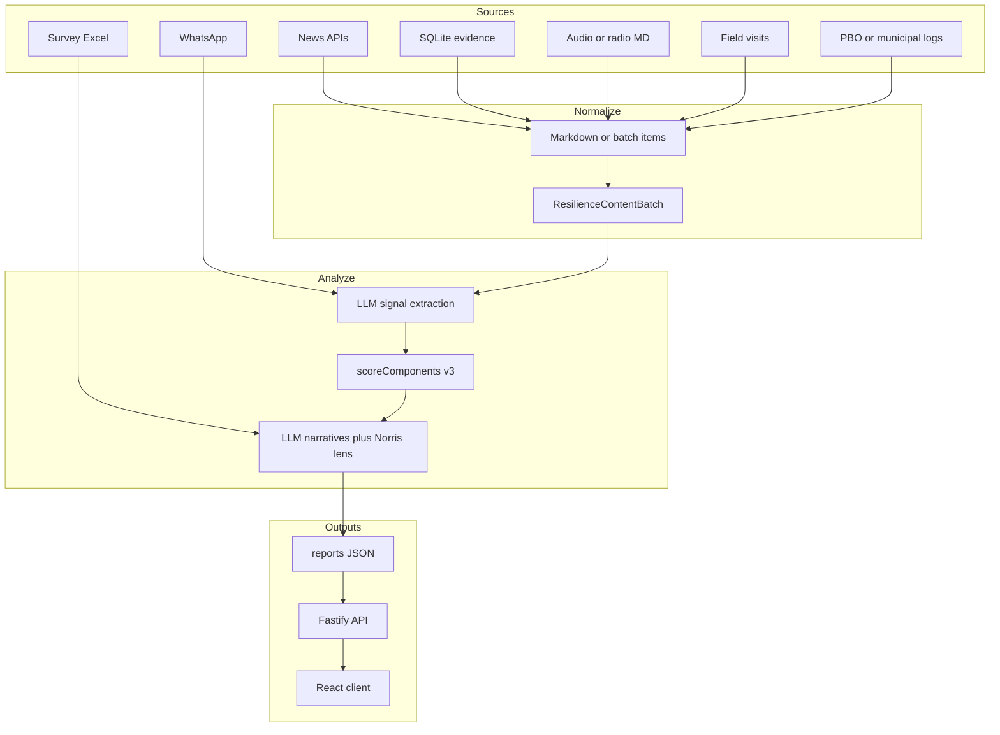
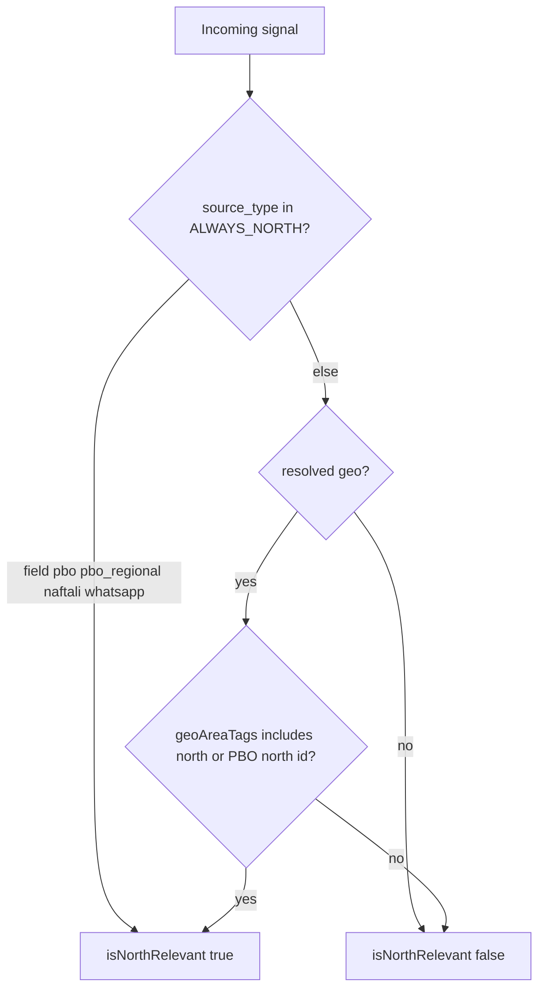

# Application architecture and analysis — deep-dive review

**Audience:** engineers, data scientists, operators, and technical stakeholders.  
**Intent:** single entry point for how this system works end-to-end: purpose, structure, data acquisition, transformation, scoring mathematics, geographic enrichment, strengths and gaps, and directions for evolution.  
**Companion docs:** this synthesizes behavior described in more detail elsewhere; prefer those sources when you need step-by-step operational instructions or full geo field semantics.

| Document | Use when you need |
|----------|-------------------|
| [Daily pipeline](./main_docu_files/PIPELINE-AND-SOURCES.md) | Ingest → extract → assess; canonical code under `business_modules/resilience/`. |
| [System overview](../../cross-cut-modules/docs/content/pages/architecture/system-overview.md) | Subsystem map, constraints, “where do I change X?” |
| [Geographic analysis — developer guide](./main_docu_files/GEOGRAPHIC-ANALYSIS.md) | `geo` envelope contract, consumer rules, wiring. |
| [Geographic analysis — implementation review](./geographic-analysis-implementation.md) | Match stages, fuzzy policy, unknown sink, audit fields. |

---

## Table of contents

1. [Executive summary](#1-executive-summary)  
2. [System structure](#2-system-structure)  
3. [Data acquisition by channel](#3-data-acquisition-by-channel)  
4. [Transformation pipeline](#4-transformation-pipeline-content--signals--assessment)  
5. [Data science, algorithms, and mathematics](#5-data-science-algorithms-and-mathematics)  
6. [Geographic analysis and the main resilience workflow](#6-geographic-analysis-and-the-main-resilience-workflow)  
7. [Strengths](#7-strengths)  
8. [Weaknesses and risks](#8-weaknesses-and-risks)  
9. [Recommended improvements](#9-recommended-improvements)  
10. [Future functionality](#10-future-functionality)  
11. [Appendix: environment variables](#appendix-a-environment-variables)  
12. [Appendix: primary file index](#appendix-b-primary-file-index)

---

## 1. Executive summary

### 1.1 Role of the application

This repository implements a **population / community resilience monitoring** stack aligned with an **eight-component** framework (Home Front Command / Pikud HaOref style): narrative, information and communication, lifesaving behavior, functional continuity, community capital, leadership, belonging and solidarity, and wellbeing of at-risk groups.

Evidence is drawn from **multiple channels** (news sites via NewsAPI.ai, optional SQLite-backed evidence such as audio or other ingests, WhatsApp field reports, radio/audio transcripts, municipal / PBO event flows, Naftali pool extraction, field visits, and structured **field surveys** from Excel). The system normalizes heterogeneous inputs into analyzable **content**, extracts **atomic behavioral signals** into a **closed vocabulary**, and applies **deterministic scoring** so that day-to-day and channel-to-channel comparisons are **auditable**. Large language models (LLMs) are used for **relevance filtering**, **signal extraction**, and **narrative synthesis**, but **not** for assigning numeric component scores.

### 1.2 Design mantra: “LLM extracts, code scores”

- The LLM classifies evidence into types from `SIGNAL_CATALOG` in [`behaviorSignals.js`](../../business_modules/resilience/domain/services/behaviorSignals.js). Unknown types are dropped by validation.  
- A fixed many-to-many map `SIGNAL_TO_COMPONENTS` defines how each signal type moves the eight component scores.  
- Component scores, confidence, coverage, diversity, bootstrap intervals, counterfactuals, and facets are computed in code (`scoreComponents` and helpers in the same module).  
- A second LLM pass generates human-readable narratives conditioned on those numbers.

### 1.3 End-to-end dataflow (conceptual)

---

## 2. System structure

### 2.1 Layers and boundaries

The workspace follows a **hexagonal / DDD-style** layout:

| Area | Responsibility |
|------|------------------|
| [`business_modules/`](../../business_modules/) | One folder per business capability (`resilience`, `geo`, `news-sites`, `whatsapp`, `audio`, `survey`, PBO modules, etc.). Each module uses `app/`, `domain/`, `infrastructure/adapters/`, and optional `input/` for CLI or HTTP entrypoints. |
| [`cross-cut-modules/`](../../cross-cut-modules/) | Persistence, budget, shared adapters, and helpers used by multiple modules (e.g. `signalGeoSummary.js` re-exports geo helpers for report code that must not deep-import geo internals). |
| [`reportCacheService.js`](../../business_modules/resilience/app/reportCacheService.js) | Report path resolution by **scope** (national vs north) and cached report reads (`getCachedReport`, `resolveReportJsonPathForDate`). |
| [`app.js`](../../app.js) / [`server.js`](../../server.js) | Fastify shell: auth, routes, **composition root** (wires `geoService`, `geoEnrichmentPort`, WhatsApp analyzer, drift routes, cached report readers). |
| [`client/`](../../client/) | React SPA: report scope toggle, dashboards, docs panel. |

**Composition rule:** business modules do not import each other arbitrarily; shared abstractions are expressed as **ports** (e.g. `IGeoEnrichmentPort`) and implemented by adapters wired only from `app.js` or dedicated scripts.

### 2.2 Two important analysis entrypoints

Readers often conflate these; they serve different operational models.

| Entry | Typical use | Scope handling |
|-------|-------------|----------------|
| [`runResilienceAssessment`](../../business_modules/resilience/app/resilienceAnalysisService.js) | One **content batch** → extract → score **all** returned signals → narratives → optional persist via injected report writer. | Does **not** call `filterSignalsForScope`. National vs north for the UI is served by **loading different saved artifacts** (`resilience-report-{date}` vs `resilience-report-north-{date}`) via [`getCachedReport`](../../business_modules/resilience/app/reportCacheService.js). |
| [`assess-signals.js`](../../business_modules/resilience/input/assess-signals.js) CLI (`npm run assess-signals`) | Multi-day, multi-file signal merge, optional semantic cross-source dedup, **14-day historical scores** for delta enrichment, **per–`source_type` scores**, and explicit **scope** for the run. | Scores the **full unscoped** signal list once (`nationalScored`) so north runs can pass **`comparisonScores`** into `generateNarratives`; then applies **`filterSignalsForScope`**; then **`scoreComponents`** on the scoped subset and **`enrichWithDeltaChannel`**; exits if the scoped set is empty. For `north`, also emits `assessment.national_comparison` using the unscoped overall score. |

**Implication:** “North” in the product is primarily **a filtered view of evidence** persisted as a **separate report artifact**, not a post-hoc filter applied inside `runResilienceAssessment` unless your operational pipeline always produces both files.

### 2.3 Client and API contract for scope and display tier

- [`GET /api/report/today`](../../app.js) accepts `?scope=north` or default national, and `?view=operator` (default) or `?view=analyst` (only when the authenticated user’s email is listed in `RESILIENCE_ANALYST_EMAILS`).  
- Responses include `display_view` and redact numeric scores for operator tier via [`assessmentDisplayTier.js`](../../business_modules/resilience/domain/services/assessmentDisplayTier.js).  
- [`GET /api/resilience/display-capabilities`](../../app.js) returns `{ canViewAnalyst }` for the optional signed-in user.  
- [`useTodayReport(scope, view)`](../../client/src/hooks/useAnalysis.js) passes scope and view query params.  
- [`MainApp.jsx`](../../client/src/MainApp.jsx) shows an **Analyst** toggle when `canViewAnalyst` is true; drift APIs are gated when the allowlist is configured.

---

## 3. Data acquisition by channel

The table below lists **primary entrypoints** (npm scripts reference [`package.json`](../../package.json)), **inputs**, and **typical outputs**. Paths are repo-relative unless noted.

| Channel | Script / entry | Key inputs | Outputs / consumers |
|---------|----------------|------------|---------------------|
| **News (home front)** | `npm run homefront-to-md` → [`extract-homefront-articles.js`](../../business_modules/news-sites/input/extract-homefront-articles.js) | `NEWSAPI_AI_KEY` or `NEWSAPI_API_KEY`, `TZ_ARTICLES`, `HOMEFRONT_MD` | Markdown article file (default under `business_modules/news-sites/articles_extracted/articles-homefront.md`); consumed by analysis and [`runResilienceAssessment`](../../business_modules/resilience/app/resilienceAnalysisService.js). |
| **News (generic fetch)** | `npm run articles-to-md` | Same API keys | Broader MD exports for tooling. |
| **Resilience from MD files** | `npm run analyze-resilience` → [`analyze-resilience.js`](../../business_modules/resilience/input/analyze-resilience.js) | Paths via CLI, `ANTHROPIC_API_KEY` | Signals and reports under `daily_reports/` (depends on CLI flags). |
| **Signals only** | `npm run extract-signals` | MD inputs | Signal JSON for downstream assess. |
| **Multi-source assess** | `npm run assess-signals` | Prior signal files, scope flags, `ANTHROPIC_API_KEY` | Scoped JSON or MD via report writer; uses `filterSignalsForScope`. |
| **Server full run** | Internal: [`runResilienceAssessment`](../../business_modules/resilience/app/resilienceAnalysisService.js) | `ANTHROPIC_API_KEY`, optional evidence **store** for DB merge, `HOMEFRONT_MD` | Assessment + cost; persists via resilience report adapter when configured. |
| **Audio / radio** | `npm run audio-to-md`, `npm run analyze-audio` | Audio pipelines, then same resilience CLI with `--content-kind audio` | MD then same extraction stack. |
| **WhatsApp** | `npm run whatsapp-to-md` plus server routes | Meta WhatsApp Cloud API, `ANTHROPIC_API_KEY` | Messages analyzed with [`whatsappResilienceAnalyzer.js`](../../business_modules/whatsapp/app/whatsappResilienceAnalyzer.js); **geo** attached when port is wired in `app.js`. |
| **Field visits** | `npm run ingest-field-reports` | Visit ingest module | Feeds evidence store / MD depending on configuration. |
| **PBO municipal event log** | `npm run analyze-event-log` | Event log adapter | Specialized municipal reporting. |
| **Survey (Excel)** | `npm run analyze-survey` → [`cross-cut-modules/geo/input/runAnalyzeSurvey.js`](../../cross-cut-modules/geo/input/runAnalyzeSurvey.js) | `--responses` `.xlsx`, mapping JSON, `ANTHROPIC_API_KEY` | Per-municipality MD reports under `daily_reports/`; **geo** on municipality name when `geoEnrichmentPort` is constructed in the script. |
| **Naftali pool** | `business_modules/pool/input/extract-naftali-signals.js` (see package or module docs) | Pool-specific inputs | Signals with explicit geographic scope in prompts. |

**SQLite:** Evidence and artifacts are persisted using helpers under `cross-cut-modules/`; path controlled by `SQLITE_PATH` (see [system overview](../../cross-cut-modules/docs/content/pages/architecture/system-overview.md)).

**Merge behavior in assessment runs:** When a **store** is passed and contains rows for “today”, home-front markdown articles are **merged** with DB-only items (news first, then DB-only), deduped by URL/title fingerprint — see resilience analysis orchestration in [`resilienceAnalysisService.js`](../../business_modules/resilience/app/resilienceAnalysisService.js).

---

## 4. Transformation pipeline (content → signals → assessment)

### 4.1 Load and normalize

- Markdown loaders (e.g. [`mdReportsLoader.js`](../../business_modules/resilience/infrastructure/mdReportsLoader.js)) produce article objects with title, URL, body, source, and metadata.  
- [`contentBatchFromMdArticles`](../../business_modules/resilience/app/contentBatchFromMdArticles.js) builds a **ResilienceContentBatch** with `contentKind` (`news`, `audio`, or derived `mixed`) and `reportDate`.  
- [`runResilienceAssessment`](../../business_modules/resilience/app/resilienceAnalysisService.js) maps batch items to the shape expected by the LLM port, capping body length to **`MAX_BODY_CHARS` (2000)** per article.  
- [`assertValidResilienceContentBatch`](../../business_modules/resilience/domain/services/resilienceBatchValidation.js) guards batch shape before work proceeds.

### 4.2 Signal extraction (LLM)

- The default implementation lives in [`claudeEvaluator.js`](../../business_modules/resilience/infrastructure/claudeEvaluator.js): batched **Haiku** extraction for cost/latency, with validators that enforce the closed catalog.  
- Optional **second pass** merge: if `RESILIENCE_SECOND_EXTRACT=1`, [`runResilienceAssessment`](../../business_modules/resilience/app/resilienceAnalysisService.js) runs extraction twice (optional model override via env) and merges with [`mergeDualExtractionSignals`](../../business_modules/resilience/infrastructure/dualModelExtract.js). Agreement can slightly boost contribution via `_dual_pass_agreement` and `RESILIENCE_DUAL_AGREEMENT_BOOST` (capped in `contributionForSignal`).

### 4.3 Deterministic scoring

- [`scoreComponents`](../../business_modules/resilience/domain/services/behaviorSignals.js) implements **v3** scoring (see §5).  
- [`overallScore`](../../business_modules/resilience/domain/services/behaviorSignals.js) aggregates an overall index as a **certainty-weighted mean** of component scores.

### 4.4 Narratives and additive lenses

- `generateNarratives` in [`claudeEvaluator.js`](../../business_modules/resilience/infrastructure/claudeEvaluator.js) runs a second LLM step to produce per-component narratives, cross-component synthesis, and evidence quality notes **grounded in** the deterministic scores.  
- **Norris et al. (2008) capacities:** [`computeNorrisCapacities`](../../business_modules/resilience/domain/services/norrisCapacities.js) derives an **additive** interpretive layer from scored components; it does not replace the eight headline scores (see markdown template in [`reportWriter.js`](../../business_modules/resilience/infrastructure/reportWriter.js)).

### 4.5 Persistence and audit metadata

- [`writeReport`](../../business_modules/resilience/infrastructure/reportWriter.js) writes sibling **`.md`** and **`.json`** files. JSON includes `assessment`, `signals`, `source_files`, `generated_at`, optional `score_by_source`, and **geo audit** fields from [`collectGeoVersionsFromSignals`](../../business_modules/geo/domain/services/geoReportDiagnostics.js): `geo_reference_versions_used`, `border_reference_versions_used` (sorted unique versions found on resolved `signal.geo`).

---

## 5. Data science, algorithms, and mathematics

This section translates the implementation in [`behaviorSignals.js`](../../business_modules/resilience/domain/services/behaviorSignals.js) into formulas an analyst can reason about.

### 5.1 Per-signal contribution (before capping)

For each signal \(s\) and component \(c\) with base weight \(w_{s,c}\) from `SIGNAL_TO_COMPONENTS` (sign included in polarity handling, magnitude used here):

\[
\text{contrib}(s,c) = |w_{s,c}| \cdot \sigma \cdot \rho \cdot \pi \cdot \delta \cdot \tau \cdot \gamma
\]

Where:

| Symbol | Meaning | Source in code |
|--------|---------|----------------|
| \(\sigma\) | **Scope weight** from `scope_level`: `single_case` (0.35), `repeated_pattern` (0.65), `quantified_or_broad` (1.0). **Default:** for `source_type === 'field'`, missing `scope_level` defaults to `repeated_pattern`; otherwise `single_case` — see `contributionForSignal` (addresses under-weighting of field reports when the LLM omits scope). |
| \(\rho\) | **Reliability** from `evidence_type` / `evidence_class` (`RELIABILITY_WEIGHT`: e.g. direct quote 1.0, observational reported fact 0.75). |
| \(\pi\) | **Outlet prior** multiplier from [`outletReliabilityPriors.js`](../../business_modules/resilience/domain/services/outletReliabilityPriors.js), applied only for `observational_reported_fact` and `named_institutional_fact` (not for direct quotes attributed to a person). |
| \(\delta\) | **Dual-pass boost** in \([1, 1.2]\) when two extractions agree (`RESILIENCE_DUAL_AGREEMENT_BOOST`, default 1.05). |
| \(\tau\) | **Temporal weight** (`temporal_weight`, default 1.0) from article or batch metadata. |
| \(\gamma\) | **Extraction confidence** clamped to \([0,1]\) (`extraction_confidence`, default 1.0). |

Polarity is tracked separately: positive vs negative mass is accumulated from contributions whose base weight sign is positive vs negative.

### 5.2 Two-layer dominance cap (fairness across outlets and channels)

[`applySourceCap`](../../business_modules/resilience/domain/services/behaviorSignals.js) prevents a single voice from dominating:

1. **By `source_type`:** no single type contributes more than **50%** of the mass on either polarity when at least two types exist.  
2. **By `article_source`:** no single outlet contributes more than **35%** of the mass on either polarity when at least two outlets exist.

Scaling uses a closed-form cap: for dominant mass \(m\) and other mass \(o\), target dominant share \(t\) yields `newDominant = t · o / (1 − t)` (documented in `capByGroup`).

Each signal in component outputs is enriched with **`_contribution`** (post-cap) and **`_contribution_raw`** (pre-cap) for explainability.

### 5.3 Component score from masses

Let \(P\) and \(N\) be positive and negative summed contributions after capping, \(M = P+N\), net \(z = P-N\). If \(M=0\), the component is **insufficient data**.

Component-specific saturation uses **`tanhK`** from `COMPONENT_TUNING`:

\[
\text{strength} = \tanh\left(\frac{z}{\text{tanhK}_c}\right)
\]

**Coverage:** with \(n\) distinct articles that contributed at least one mapped signal for this component and \(T\) total articles in the run:

\[
\text{coverageRatio} = \frac{n}{\max(T,1)}, \quad
\text{coverageAdj} = 0.70 + 0.30 \sqrt{\text{coverageRatio}}
\]

**Source diversity factor:** with \(K\) distinct `source_type` values among contributing signals,

\[
\text{sourceDiv} = 0.85 + 0.15 \min\left(1,\frac{K-1}{3}\right)
\]

**Type diversity factor:** Shannon entropy \(H\) over signal-type counts, normalized by maximum entropy for the observed number of distinct types:

\[
\text{typeDiv} = 0.90 + 0.10 \cdot \frac{H}{H_{\max}}
\]

**Adjusted strength and discrete score:**

\[
\text{adj} = \text{strength} \cdot \text{coverageAdj} \cdot \text{sourceDiv} \cdot \text{typeDiv}, \quad
\text{score}_{\text{raw}} = \text{round}\bigl(5.5 + 4.5 \cdot \text{adj}\bigr), \quad
\text{score} = \text{clamp}(\text{score}_{\text{raw}}, 1, 10)
\]

**Thin-evidence floor:** if \(M < 1.5\), the score is further clamped to **[3, 8]** and `floor_clamped` is set when binding.

### 5.4 Certainty, confidence labels, polarization

- **Certainty:** \(\text{certainty} = 1 - \exp(-M / \text{certM}_c)\) with per-component `certM`.  
- **Heuristic confidence** (`low` / `medium` / `high`): combines certainty thresholds and counts of distinct articles (see `scoreComponents` around certainty and `distinctArticleCount`).  
- **Polarization:** \(\text{pol} = 1 - |z|/M\) when \(M>0\) (high when positive and negative evidence are both large).

### 5.5 Bootstrap confidence intervals and counterfactual

- **`BOOTSTRAP_SAMPLES = 200`** with a **deterministic seeded RNG** (`BOOTSTRAP_SEED`) resamples contributions to produce `score_low` / `score_high` (approximate 5th/95th percentiles of rounded scores). `ci_unstable` flags pathological resample outcomes.  
- **Counterfactual:** removes the single **dominant article** (by pre-cap polarity mass), reapplies caps, recomputes score — surfaces sensitivity to one story (`counterfactual_article_key`, `counterfactual_delta`).

### 5.6 Facets

Some components expose **sub-facets** (see `computeFacets` and [`componentFacets.js`](../../business_modules/resilience/domain/services/componentFacets.js)): within-component groupings scored with a **tanh** on net facet evidence (separate tuning path from the headline score).

### 5.7 Explicit limitations (for DS readers)

- Weights and tuning constants are **author-set**, not learned from labeled data inside this repo. `COMPONENT_TUNING` comments note intent to revisit with **30+ days** of history for calibration-style work.  
- LLM extraction introduces **stochastic bias** (temperature 0 still leaves model versioning and prompt sensitivity).  
- **Survey path** uses LLM assessment per municipality in [`surveyEvaluator.js`](../../business_modules/resilience/app/surveyEvaluator.js) (checkpointed batches + regional synthesis) — a different orchestration than article signal extraction, though it shares component definitions from [`resilienceComponents.js`](../../business_modules/resilience/domain/resilienceComponents.js).

---

## 6. Geographic analysis and the main resilience workflow

Geographic capability is deliberately **non-LLM**: a deterministic resolver turns free-text locality strings into a **versioned `geo` envelope** (subregion, tags, distance-to-border band, match diagnostics, quality, and policy flags). That design is documented in [GEOGRAPHIC-ANALYSIS.md](../main_docu_files/GEOGRAPHIC-ANALYSIS.md) and reviewed in depth in [geographic-analysis-implementation.md](./geographic-analysis-implementation.md).

### 6.1 Module boundary

- **Domain port (consumer side):** [`IGeoEnrichmentPort`](../../business_modules/resilience/domain/ports/IGeoEnrichmentPort.js) — `resolveLocalityName(rawName)`.  
- **Adapter:** [`geoEnrichmentAdapter.js`](../../business_modules/resilience/infrastructure/adapters/geoEnrichmentAdapter.js) delegates to `createGeoService` from [`business_modules/geo`](../../business_modules/geo/app/geoService.js).  
- **Composition:** real adapter in [`app.js`](../../app.js) (server) and [`runAnalyzeSurvey.js`](../../cross-cut-modules/geo/input/runAnalyzeSurvey.js) (CLI). Tests or missing wiring use **`NoOpGeoEnrichmentPort`** (`kind: 'unknown', reason: 'GEO_DISABLED'`).

### 6.2 Reference data and math

- **Localities:** [`north-reference.json`](../../business_modules/geo/data/north-reference.json) — canonical keys, multilingual names, coordinates, PBO-aligned `subregionId` / `pboSubregionId` semantics.  
- **Border:** simplified polyline [`north-border.json`](../../business_modules/geo/data/north-border.json) for **distance-to-border** bands (see `distanceBand` services).  
- **Matching:** staged normalization (exact, punctuation, Hebrew finals, conservative fuzzy with ambiguity detection), then macro-area terms — see implementation review §4–§6.  
- **Quality policy:** [`geoQualityPolicy.js`](../../business_modules/geo/domain/services/geoQualityPolicy.js) sets `quality`, `usableForMetrics`, `requiresReview`, and drives **`scopeConfidence`**.

### 6.3 Where `geo` is attached

| Consumer | When `geo` appears | Code |
|----------|-------------------|------|
| **WhatsApp** | After extraction / structured locality normalization; **same envelope** copied onto **every signal** from the message and onto `structured.observation.geo`. Optional `GEO_ASSERT_ENVELOPE=1` validates against schema. | [`whatsappResilienceAnalyzer.js`](../../business_modules/whatsapp/app/whatsappResilienceAnalyzer.js) `attachGeoToSignalsAndStructured` |
| **Survey** | After per-municipality LLM assessment; **`m.geo`** from resolving **`m.name`**. | [`analyzeSurveyInput.js`](../../business_modules/resilience/input/analyzeSurveyInput.js); rendered in [`surveyReportWriter.js`](../../business_modules/resilience/app/surveyReportWriter.js) |
| **News / generic MD extraction** | Signals produced by [`claudeEvaluator.js`](../../business_modules/resilience/infrastructure/claudeEvaluator.js) **do not** automatically receive per-article `geo` resolution today. North scoping for those signals relies on **keyword fallback** and **`source_type`** rules (§6.5). |

### 6.4 Two different “scope decisions” (do not confuse them)

1. **`geo.scopeDecision`** (on resolved envelopes inside `geoService`): “From **this geo object alone**, is north-from-geo allowed?” Built by `buildGeoScopeDecision` — sources restricted to `geo` | `geo_tags` | `pbo_subregion` | `unknown` (see schema in [`geoEnrichmentSchema.js`](../../business_modules/geo/domain/value_objects/geoEnrichmentSchema.js)).  
2. **`signal.scopeDecision`** (attached in [`regionSignalFilter.js`](../../business_modules/resilience/domain/services/regionSignalFilter.js)): full **north filter trace** for analytics and UI explainability, including **`source_type`** bypass and **`keyword_fallback`**.

### 6.5 How geography enters **main** north-scoped analysis

North filtering is implemented by [`scopeDecisionForSignal`](../../business_modules/resilience/domain/services/regionSignalFilter.js) and applied by [`filterSignalsForScope`](../../business_modules/resilience/domain/services/regionSignalFilter.js):

**`ALWAYS_NORTH_SOURCE_TYPES`:** `field`, `pbo`, `pbo_regional`, `naftali`, `whatsapp` — these signals count as north **without** requiring resolved geo (operational assumption: those channels are already north-scoped by collection or prompt design).

**Resolved geo path:** if `signal.geo.kind === 'resolved'`, north relevance comes from **`geoAreaTags`** containing **`north`** or **`pboSubregionId`** in `{naftali, golan, baram, hiram, galma}` via [`northRelevanceFromResolvedGeo`](../../cross-cut-modules/geo/northRelevanceFromResolvedGeo.js). This includes rows where **`usableForMetrics === false`** or **`resolution.provenance === 'text_inferred'`** — they may still be **north-scoped for narrative** but are excluded from component metrics under **`RESILIENCE_EPISTEMIC_GEO_V2`** (default on).

**No keyword fallback:** text substring north matching (`NORTH_TERMS`) was removed. News/radio/social without resolved north geo are **not** north-relevant.

**`assess-signals` integration:** after optional dedup, the CLI always runs `filterSignalsForScope(allSignals, reportScopeId)` so every signal gains **`signal.scopeDecision`**. When `reportScopeId === 'north'`, the array is **filtered** to `isNorthRelevant` only; for `national`, all signals are retained. Scoring then uses the (possibly narrowed) list and recomputes `totalArticles` for coverage from **scoped** article keys when not national — see [`assess-signals.js`](../../business_modules/resilience/input/assess-signals.js).

### 6.6 How this interacts with `runAnalysis` / cached reports

- The HTTP reader [`getCachedReport`](../../business_modules/resilience/app/reportCacheService.js) picks **`resilience-report-{date}`** vs **`resilience-report-north-{date}`** using [`reportPrefixForScope`](../../business_modules/resilience/app/reportCacheService.js).  
- Therefore, operations that need a north dashboard must **produce** the north-prefixed JSON (typically via `assess-signals` or an equivalent pipeline), not assume `runResilienceAssessment` alone filtered signals.

### 6.7 Operational feedback loop

Unknown or ambiguous localities can be routed to review sinks when configured (`GEO_UNKNOWN_REVIEW_JSONL`, `GEO_UNKNOWN_REVIEW_SQLITE`, overrides via `GEO_OVERRIDES_SQLITE`) — see [`app.js`](../../app.js) wiring and the implementation review §9. That closes the loop between **field reality** and **reference table** updates.

---

## 7. Strengths

1. **Separation of concerns:** clear ports/adapters; geo and resilience stay testable in isolation (`tests/business_modules/geo`, `tests/business_modules/resilience`).  
2. **Auditable scoring:** numeric outcomes replay from stored signals + versioned code — suitable for governance review.  
3. **Explainability:** per-signal contributions, dominance caps, counterfactual article, bootstrap CIs, polarization, facets, and `scopeDecision` traces.  
4. **Geographic hygiene:** explicit **`usableForMetrics`** gate prevents fuzzy leakage into north KPIs; version stamps on envelopes and report JSON support reproducibility.  
5. **Multi-channel fusion path:** `assess-signals` + caps + diversity factors mitigate “single outlet echo chamber” failure modes.  
6. **Cost awareness:** token pricing hooks in analysis service and budget utilities across scripts.

---

## 8. Weaknesses and risks

**Phase-1 transparency (addressed in code, not eliminated):** Each assess run persists `assessment.methodology` (author-set weights manifest on disk, scope-decision counts, epistemic copy, advisory `tuning_proposal`). Operator UI shows epistemic banners and north keyword-fallback warnings; `GET /api/report/today?scope=north` returns `north_requires_assess_signals` when no north artifact exists. **Still deferred:** multi-district scope, fitted weights, auto-applied tanhK/certM, merging `runResilienceAssessment` with `filterSignalsForScope`.

1. **Documentation drift:** [`docs/main_docu_files/PIPELINE-AND-SOURCES.md`](../main_docu_files/PIPELINE-AND-SOURCES.md) points at `business_modules/resilience/`; keep other docs in sync when modules move.  
2. **North scope without geo on news:** signals without resolved north geo are excluded from north scope (no keyword fallback). Hyperlocal placenames only count when geo attach succeeds — monitor `summarizeGeoCoverage` / unknown rates.  
3. **Dual pipelines (`runResilienceAssessment` vs `assess-signals`):** easy to misconfigure if operators expect scope filtering in the API-run path when only national scoring ran.  
4. **LLM brittleness:** model upgrades, prompt drift, and multilingual edge cases affect extraction rates; monitoring is mostly operational (logs, costs) rather than a packaged offline benchmark suite in-repo.  
5. **Hand-tuned weights:** political and ethical tradeoffs are embedded in `SIGNAL_TO_COMPONENTS`; stakeholders may read scores as “objective” without seeing the normative choices.  
6. **Deployment coupling:** single Node serves API and static client per product architecture — acceptable at current scale, limits independent scaling.

---

## 9. Recommended improvements

1. **Doc alignment:** canonical paths callout added to [`docs/main_docu_files/PIPELINE-AND-SOURCES.md`](../main_docu_files/PIPELINE-AND-SOURCES.md); keep other specs in sync when modules move.  
2. **News + controlled geo:** extract candidate place names from titles or first paragraphs → `resolveLocalityName` with **strict** `usableForMetrics` rules and human review for new aliases.  
3. **Gold-set evaluation:** periodic labeled audit set for extraction precision/recall by `signal_type` and by language.  
4. **Calibration study:** treat `COMPONENT_TUNING` and selected weights as parameters fit with constraints (monotonicity, max sensitivity per day).  
5. **Telemetry:** `assessment.methodology.scope.scope_decision_summary` on each assess run; operator UI warns when north keyword-fallback share is high.  
6. **Single mental model for scope:** either document-only clarity (status quo) or add an optional `scope` parameter to server-side assessment that applies `filterSignalsForScope` before scoring — product tradeoff between **one** national signal file vs **two** artifacts.

---

## 10. Future functionality

- **Time-series and drift:** drift routes and services already exist (`registerDriftRoutes` in `app.js`); extend with automated anomaly detection on component scores.  
- **Stronger temporal modeling:** explicit half-life decay by `publishedAt` instead of only `temporal_weight` where present.  
- **Geo review UI:** operational queue for unknowns feeding reference JSON builders (`npm run build:north-reference` pipeline).  
- **Multilingual normalization:** cross-lingual dedup and translation-gated extraction for Arabic and Russian sources where licenses permit.  
- **Probabilistic geo:** when ambiguity is detected, carry a **set** of candidate envelopes with weights for sensitivity analysis (only if product accepts complexity).  
- **Survey ↔ daily report fusion:** structured merge of municipality assessments into the same `assess-signals` batch with explicit `source_type` weighting rules.

---

## Appendix A: Environment variables

Non-exhaustive list of variables referenced across analysis, geo, and client-facing behavior:

| Variable | Role |
|----------|------|
| `ANTHROPIC_API_KEY` | Required for Claude-based extraction, narratives, WhatsApp analysis, surveys. |
| `NEWSAPI_AI_KEY` / `NEWSAPI_API_KEY` | NewsAPI.ai authentication for news ingest. |
| `TZ_ARTICLES` | “Today” timezone for article dating and report dates (default `Asia/Jerusalem`). |
| `HOMEFRONT_MD` | Override path to home-front markdown file. |
| `SQLITE_PATH` | SQLite database file for evidence and related rows. |
| `RESILIENCE_SECOND_EXTRACT` / `RESILIENCE_SECOND_EXTRACT_MODEL` / `RESILIENCE_SECOND_MODEL` | Optional dual extraction pass. |
| `RESILIENCE_DUAL_AGREEMENT_BOOST` | Dual-pass contribution boost (clamped). |
| `GEO_LEGACY_SUBREGION_ID` | Emit or omit deprecated `subregionId` duplicate on geo envelopes. |
| `GEO_ASSERT_ENVELOPE` | Validate envelope immediately after WhatsApp attach. |
| `GEO_OVERRIDES_SQLITE` | Enable SQLite-backed geo overrides (composition). |
| `GEO_UNKNOWN_REVIEW_JSONL` / `GEO_UNKNOWN_REVIEW_SQLITE` | Unknown locality review sinks. |
| `RESILIENCE_EPISTEMIC_GEO_V2` | Exclude text-inferred / metrics-unsafe geo from component scores (default on; `=0` for legacy). |
| `TRANSLATION_ENABLED` | Gate server-side report translation. |
| `AUTH_REQUIRED` | Gate API routes and docs pages. |
| `RESILIENCE_DRIFT_*` | Drift alert thresholds (polarization window, etc.) — see client i18n help strings. |
| `RESILIENCE_ANALYST_EMAILS` | Comma-separated emails allowed analyst display tier and gated drift APIs. |
| `RESILIENCE_NARRATIVE_INCLUDE_SCORES` | Default `false`; set `true` to pass 1–10 scores into narrative LLM prompts. |

Always treat this table as **hints**; authoritative behavior is the code path that reads each variable.

---

## Appendix B: Primary file index

| Concern | File |
|---------|------|
| v3 scoring | [`business_modules/resilience/domain/services/behaviorSignals.js`](../../business_modules/resilience/domain/services/behaviorSignals.js) |
| North filter | [`business_modules/resilience/domain/services/regionSignalFilter.js`](../../business_modules/resilience/domain/services/regionSignalFilter.js) |
| LLM extract + narratives | [`business_modules/resilience/infrastructure/claudeEvaluator.js`](../../business_modules/resilience/infrastructure/claudeEvaluator.js) |
| Server batch orchestration | [`business_modules/resilience/app/resilienceAnalysisService.js`](../../business_modules/resilience/app/resilienceAnalysisService.js) |
| Cached report paths | [`reportCacheService.js`](../../business_modules/resilience/app/reportCacheService.js) |
| Multi-source CLI | [`business_modules/resilience/input/assess-signals.js`](../../business_modules/resilience/input/assess-signals.js) |
| Report files | [`business_modules/resilience/infrastructure/reportWriter.js`](../../business_modules/resilience/infrastructure/reportWriter.js) |
| Geo service | [`business_modules/geo/app/geoService.js`](../../business_modules/geo/app/geoService.js) |
| WhatsApp + geo attach | [`business_modules/whatsapp/app/whatsappResilienceAnalyzer.js`](../../business_modules/whatsapp/app/whatsappResilienceAnalyzer.js) |
| Survey CLI | [`business_modules/resilience/input/analyzeSurveyInput.js`](../../business_modules/resilience/input/analyzeSurveyInput.js) |
| Survey Excel parse | [`business_modules/survey/infrastructure/adapters/surveyExcelLoader.js`](../../business_modules/survey/infrastructure/adapters/surveyExcelLoader.js) |
| Client report fetch | [`client/src/hooks/useAnalysis.js`](../../client/src/hooks/useAnalysis.js) |
| App composition | [`app.js`](../../app.js) |

---

*End of document.*
