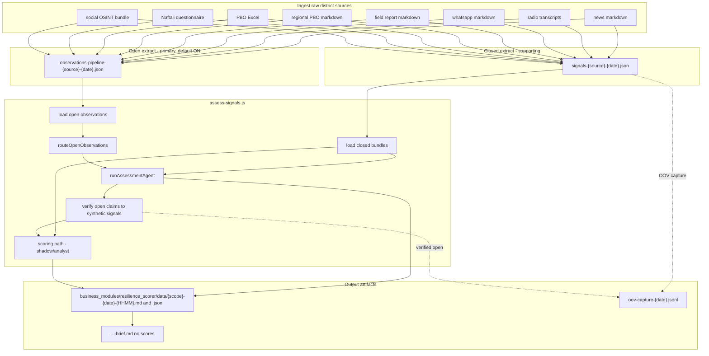

# 02 - The Dual-Path Pipeline

## What this answers

- What the **two analysis paths** are and which one is primary.
- How raw district data becomes **open observations** and **closed-vocabulary signals**.
- Exactly **where and how** the two paths merge.
- How the pipeline is **orchestrated** and what **artifacts** it writes at each stage.

## 1. The core idea: two paths, different jobs

The resilience pipeline runs **two extraction tracks in parallel** over the same source material, then brings them together at assessment time.

| Path | What it produces | Role | Primary consumer |
|------|------------------|------|------------------|
| **Open analysis** (primary) | Free-form behavioral **observations**, no fixed vocabulary | The main investigative lens; captures whatever the data actually shows | The **assessment agent** |
| **Closed vocabulary** (supporting) | **Signals** typed against a fixed catalog (8-component model) | Structured, comparable, deterministically scorable | The **scoring path** (de-emphasized; analyst/shadow) and baseline investigation signals |

The intuition: the **closed catalog** is good at counting and comparing things we already know how to name, but it is blind to anything outside its vocabulary. The **open path** has no such blind spot - it records behavioral facts even when no catalog type fits - which is why it is the **primary input to the agent's reasoning**. The closed path then provides structure and a measurable backbone in a supporting role.

## 2. The open analysis path (primary)

### 2.1 What "open extract" does

Open extraction reads source text and asks an LLM to record **behavioral observations** with **no fixed `signal_type`** and **no scoring**. The pipeline profile prompt explicitly instructs the model to:

- **not** assign a snake_case `signal_type`,
- **not** score components,
- capture behavioral facts **even when no catalog type fits**,
- optionally suggest `suggested_catalog_types`, `nearest_existing_types`, and a `suggested_component`.

Implementation:

- Standalone CLI: `business_modules/open_observation_extraction/input/extract-observations.js`.
- Pipeline (parallel) service: `business_modules/open_observation_extraction/app/pipelineOpenExtractService.js` -> `runPipelineOpenExtract`.
- LLM adapter: `business_modules/open_observation_extraction/infrastructure/adapters/anthropicOpenExtractionAdapter.js` (`extractObservations`, batches of 8, Haiku).
- Prompts: `business_modules/open_observation_extraction/domain/services/openExtractionPrompts.js` (`buildOpenExtractionPrompt`, `buildResidualExtractionPrompt`).
- Normalize + bundle: `business_modules/open_observation_extraction/app/signalsExtractionService.js` (`extractAndSave`).
- Persist: `business_modules/open_observation_extraction/infrastructure/adapters/observationFsAdapter.js` (`writeBundle`).

### 2.2 The open artifact

Canonical path (`business_modules/resilience_scorer/domain/services/pipelineArtifactPaths.js`, `pipelineOpenObservationsPath`):

```
business_modules/open_observation_extraction/data/observations-pipeline-{sourceType}-{date}.json
```

Source types wired in code: `news`, `radio`, `whatsapp`, `field`, `social`, `pbo`, `pbo_regional`, `naftali`.

Bundle shape: `{ profile, content_kind, source_type, date, extracted_at, source_files, total_articles, observations[] }`.

### 2.3 Default: OFF on closed-core branch

Parallel pipeline open extract is **disabled by default**. `RESILIENCE_OPEN_EXTRACT_PARALLEL` must be `1` / `on` to enable. Legacy full dual-path also requires `RESILIENCE_OPEN_PIPELINE_LEGACY=1`.

- **OFF (default):** closed catalogue extract only; `runPipelineOpenExtract` no-ops; open backfill ingest steps skipped.
- **ON + legacy:** closed + open extraction in parallel; ingest planner may schedule `extract_open_only` backfill.

Omission audit (`RESILIENCE_OMISSION_AUDIT`, default ON) replaces pipeline open feed with `omission-audit-{scope}-{date}.json` metadata.

## 3. The closed vocabulary path (supporting)

### 3.1 The fixed taxonomy (8-component model)

The closed vocabulary lives in `cross-cut-modules/resilience-contracts/`:

- `signalCatalog.js` - `SIGNAL_CATALOG`, `SIGNAL_TO_COMPONENTS` (many-to-many signal -> component weights), `CATALOG_VERSION`.
- `componentIds.js` - the eight canonical component ids:

```2:11:cross-cut-modules/resilience-contracts/componentIds.js
export const COMPONENT_IDS = [
  'narrative',
  'information_communication',
  'lifesaving_behavior',
  'functional_continuity',
  'community_capital',
  'leadership',
  'belonging_solidarity',
  'wellbeing_at_risk',
];
```

- `resilienceComponents.js` - `RESILIENCE_COMPONENTS` (definitions, guiding questions, behavioral manifestations).
- `extractionPrompt.js` - the closed extraction prompt contract.

Routing from a closed signal to components: `business_modules/resilience_scorer/domain/services/signalRouter.js` (`getComponentWeight`, `getComponentWeightsForSignal`).

### 3.2 Closed extract

- CLI: `business_modules/resilience_scorer/input/extract-signals.js` -> `runExtractSignalsCli`.
- App: `business_modules/resilience_scorer/app/extraction/extractSignalsCli.js` loads markdown, archives sources, then calls `runExtractionStage`.
- Closed leg: `business_modules/resilience_scorer/infrastructure/claudeExtraction.js` (`extractSignals`) injects the formatted catalog and **validates** that every emitted `signal_type` belongs to `SIGNAL_CATALOG` (unknown types are dropped).

### 3.3 The closed artifact

Canonical signal bundles (`pipelineArtifactPaths.js`):

```
business_modules/resilience_scorer/data/signals/signals-{source}-{date}.json
```

with source-specific exceptions: field at `business_modules/visits/data/signals/signals-field-{date}.json`, social at `business_modules/social_media/data/signals-social-{date}.json`, regional PBO as `signals-pbo_regional-{date}.json`.

Bundle shape: `{ source_type, content_kind, [district_id], date, extracted_at, source_files, total_articles, signals[] }`. Each signal carries a catalog `signal_type`, `evidence`, `evidence_class`, `scope_level`, `confidence`, etc.

### 3.4 OOV capture (closing the open/closed gap)

Because the open path can see things the catalog cannot name, the system **captures** what it can't classify:

- During closed extract, out-of-vocabulary captures are buffered (`business_modules/resilience_scorer/infrastructure/learningCapture.js`, `business_modules/resilience_scorer/domain/services/oovCapture.js`) to `business_modules/resilience_scorer/data/oov-capture-{date}.jsonl`.
- After assessment, verified open observations are also enqueued as OOV capture records (`business_modules/resilience_scorer/app/catalog/enqueueVerifiedOpenForCatalog.js`).

The analyst-facing tooling that turned these captures into gap reports and draft catalog proposals for review (the `signal_catalog_evolution` module) has been retired. Any resulting catalog additions to `signalCatalog.js` are now a manual, out-of-band edit informed by the raw capture files, not an automated proposal workflow.

## 4. Where the two paths merge

They do **not** merge at extract time - they stay in separate files. They merge at **assess** time, in three layers (entry: `business_modules/resilience_scorer/input/assess-signals.js` -> `business_modules/resilience_scorer/app/assessment/assessSignalsCli.js`).

### Layer A - Parallel load (still separate)

- Closed bundles via `createSignalBundlePort` (default `bundleSource: 'closed'`) -> `allSignals`.
- Open bundles via `loadOpenObservationsForAssess` (`business_modules/resilience_scorer/app/loadOpenObservationsForAssess.js`), loading `profile: 'pipeline'` observation bundles.

### Layer B - Route open observations to components, then feed the agent

- `routeOpenObservations` (`business_modules/open_observation_extraction/domain/services/openObservationRouter.js`) assigns each open observation to one of the eight components (mode `RESILIENCE_OPEN_OBS_ROUTING`, default `llm`, keyword fallback).
- The routed open observations are passed as `scoring.openObservations` into the assessment agent (`runAssessmentAgent`), where `loadInvestigationContext` merges them with JSONL residuals and groups them `residualByComponent` (gated by `RESILIENCE_OPEN_OBS_FOR_AGENT`, default ON).

So the agent's **primary inputs** are: closed `investigationSignals` **plus routed open observations** plus RAG/evidence-graph context. The open path is what lets the agent investigate beyond the catalog.

### Layer C - Optional post-agent synthetic scoring (analyst/shadow only)

- `applyOpenEvidenceScoringIfVerified` (in `app/assessment/assessSignalsCli.js`): agent claims that reference an open observation (`open:{observation_id}`) and are corroborated can be turned into synthetic closed-shaped signals (`open_evidence_synthetic: true`) and re-scored.
- This affects the analyst/shadow score only; the operator brief stays claim-first.
- Verified open observations are also enqueued as OOV capture records (section 3.4).

## 5. Orchestration

The unified runner threads ingest -> extract -> assess:

```
run-pipeline.js
  -> runPipelineOrchestrator      (pipelineOrchestrator.js)
       -> buildPipelineIngestPlan (pipelineIngestPlan.js)
       -> executeIngestStep       (per planned action)
  -> assess-signals.js            (unless --ingest-only)
```

- `business_modules/resilience_scorer/input/run-pipeline.js` - CLI entry.
- `business_modules/resilience_scorer/app/pipelineOrchestrator.js` - `runPipelineOrchestrator`, `executeIngestStep`, force-delete handling.
- `business_modules/resilience_scorer/app/pipelineIngestPlan.js` - `buildPipelineIngestPlan`, decides which ingest/extract steps are needed (including backfilling missing open bundles).
- `business_modules/resilience_scorer/domain/services/pipelineArtifactPaths.js` - canonical artifact paths.
- Which sources participate is set in `pipeline-config.json` (repo root).

Representative ingest-plan actions -> spawned targets: `fetch_news` -> `homefront-to-md`; `extract_news`/`extract_radio`/`extract_whatsapp`/`extract_field` -> `extract-signals.js`; `extract_open_only` -> open-only extract; `extract_pbo_date` -> PBO extract; `extract_naftali` -> Naftali extract; `extract_regional_pbo` -> regional PBO extract; `social_gather` -> social gather.

## 6. End-to-end artifact map



## 7. Key environment flags

| Variable | Default | Effect |
|----------|---------|--------|
| `RESILIENCE_OPEN_EXTRACT_PARALLEL` | OFF (empty = disabled) | Produce open observation bundles in parallel at extract time |
| `RESILIENCE_OPEN_PIPELINE_LEGACY` | OFF | Enable `extract_open_only` ingest backfill and legacy pipeline open path |
| `RESILIENCE_OPEN_OBS_FOR_AGENT` | OFF | Feed routed open observations into the assessment agent |
| `RESILIENCE_OPEN_OBS_ROUTING` | `keyword` | How open observations are routed to components (`llm` optional) |
| `RESILIENCE_OMISSION_AUDIT` | ON (closed-core branch) | Write `omission-audit-{scope}-{date}.json`; no open obs agent feed |
| `RESILIENCE_CLOSED_CORE_ASSESS` | ON (closed-core branch) | Assess via closed signals + hybrid narrative pipeline (digest + facts/polish; no specialists) |
| `RESILIENCE_NARRATIVE_CONTEXT_MAX_TOKENS` | 180000 | Preflight ceiling per narrative LLM call; degrade ladder lowers digest before overflow |
| `RESILIENCE_NARRATIVE_DIGEST_SIGNALS` | 15 | Max signals per component in narrative digest (ladder may lower) |
| `RESILIENCE_NARRATIVE_DIGEST_EVIDENCE_CHARS` | 500 | Evidence trim in digest |
| `RESILIENCE_NARRATIVE_FACTS_SHARD_SIZE` | 4 | Haiku facts-pass shard width |
| `RESILIENCE_NARRATIVE_PIPELINE` | hybrid | Set `legacy` to restore monolithic Sonnet Step 2 (`generateNarrativesLegacy`) |
| `RESILIENCE_ASSESSMENT_AGENT_LEGACY` | OFF | Re-enable multi-agent `runAssessmentAgent` path |
| `RESILIENCE_OPEN_EVIDENCE_SCORING` | **OFF** | Post-agent synthetic scoring from verified open claims (analyst/shadow). **Production default: OFF** — enable only after auditing the open-path verification gate. Set to `1` or `on` to enable. |
| `ASSESS_BUNDLE_SOURCE` | `closed` | Alternate assess mode that maps observation bundles to pseudo-signals |
| `RESILIENCE_REPLAY_REUSE_NEWS` | OFF (unset) | In **replay** mode (`--date` ≠ today), reuse cached news signals instead of full re-extract |
| `RESILIENCE_REPLAY_REUSE_RADIO` | OFF | Same for radio transcripts |
| `RESILIENCE_REPLAY_REUSE_WHATSAPP` | OFF | Same for WhatsApp |
| `RESILIENCE_REPLAY_REUSE_FIELD` | OFF | Same for field visit reports |
| `RESILIENCE_REPLAY_REUSE_PBO` | OFF | Same for municipal PBO |
| `RESILIENCE_REPLAY_REUSE_NAFTALI` | OFF | Same for Naftali source |
| `RESILIENCE_REPLAY_REUSE_SOCIAL` | OFF | Same for social (plan `reuse` step only; historical X/Telegram cannot be re-gathered) |
| `RESILIENCE_REPLAY_REUSE_PBO_REGIONAL` | OFF | Same for regional PBO |

**Replay reuse profile:** Leave all `RESILIENCE_REPLAY_REUSE_*` unset (or `0`) for dev — backdated runs schedule full dual-path extract per source. Set to `1` / `true` / `on` for prod-style replay that reuses cached closed bundles (+ open-only backfill when open obs are missing). `--force` always re-extracts all sources. Today-mode reuse rules are unchanged.

## 8. Degraded mode

When the LLM specialist call fails or returns unusable output, `app/assessment/assessSignalsCli.js` degrades gracefully:

- **`assessment_mode: 'keyword'`** — the open path falls back to keyword-based routing. Signal counts are preserved but open-path narrative quality is reduced.
- **`assessment_mode: 'abstained'`** — no signal-based report can be produced. The report still contains `data_void` metadata and attention items.
- The UI (`epistemicBannerMessages.js`) shows a **pulsing red error banner** (error severity) when `assessment_degraded` is detected, visually distinguishing it from standard warning banners.
- Analysts can inspect the `shadow_scoring.assessment_mode` field in the report to understand which path was active.

**Cron note:** see `scripts/README.md` for the recommended two-window schedule (06:00 + 14:00 Israel time). The afternoon run supersedes the morning run via the `generated_at`-based report cache. If the data is older than 4 hours, the UI shows a freshness banner automatically.

## 9. One-paragraph summary

Ingest district sources -> in parallel, extract **closed catalog signals** (supporting) and **open free-form observations** (primary) -> at assess time, load both separately, **route open observations to components and feed them, with closed signals, into the assessment agent** -> the agent produces evidence-backed claims -> optionally, verified open claims become synthetic signals for the de-emphasized shadow score (default OFF in production) -> write claim-first reports and buffer out-of-vocabulary observations from the open path for manual catalog review.
