# 04 - The Assessment Agent

## What this answers

- How the **assessment agent** turns evidence into **claim-backed component assessments** - the system's primary, operator-facing product.
- The four-stage flow: **planner -> specialists -> critic -> synthesizer**.
- The **evidence graph** and the **claim** data shape.
- How **abstention** is enforced at every stage.
- What the agent produces for the operator: **decision brief**, **attention items**, and an **action compass**.

## 1. Why an agent, not a formula

A scoring formula can tell you a number. It cannot tell you *what is going on*, *what the evidence is*, *where it is contradictory*, or *what is missing*. The district officer needs the latter. So the daily assessment is **agent-primary, score-secondary**: an investigation agent reasons over the evidence and produces grounded claims; the deterministic score (file 05) runs alongside as a shadow/analyst artifact.

Entry point: `runAssessmentAgent(params)` in `business_modules/resilience_assessment/app/assessmentOrchestrator.js` (line 267). It is invoked from the pipeline via `business_modules/resilience/app/produceAssessmentWithShadow.js` (`tryAssessmentAgent`). It returns `{ assessmentV2, assessment (legacy), traceId, budget, evidenceGraph }`.

## 2. The flow

```mermaid
flowchart LR
  signals[closed signals + routed open observations] --> ep[computeEpistemicProfile]
  ep --> planner[runPlannerAgent]
  planner --> rag[RAG + buildEvidenceGraph]
  rag --> specialists[runComponentSpecialist per component]
  specialists --> critic[runCriticChecks + repair]
  critic --> cross[cross-component consistency]
  cross --> replan[optional one-hop replan]
  replan --> synth[runSynthesizerAgent]
  synth --> v2[assessmentV2]
```



### Stage A - Planner

`runPlannerAgent` (`business_modules/resilience_assessment/app/plannerAgent.js`, line 112) builds an **investigation plan** (tool `submit_plan`):

```js
{
  focus_components: string[],
  investigation_tasks: [{ id, type, topic, component_id, sources, reason? }],
  gap_closure_tasks: [{ id, gap_id, component_id, gap_type, action, type }],
  abstention_components: string[],
  budget: { max_rounds, model_tier },
  planner_source: 'deterministic' | 'llm' | 'replan'
}
```

It can run as a deterministic plan or an LLM plan (`shouldUseDeterministicPlanner`, `business_modules/resilience_assessment/domain/services/plannerPolicy.js`). Components with too little investigative mass are pushed into `abstention_components` via `shouldAbstainFromInvestigation` (`business_modules/epistemic_features/domain/services/investigationEpistemic.js`).

### Stage B - RAG and evidence graph

Between planning and specialists, the orchestrator fetches retrieval hits and builds an **evidence graph** (`cross-cut-modules/retrieval/evidenceGraph.js`, `buildEvidenceGraph`). It also enriches the epistemic profile for investigation (`investigation_mass`, `thin_for_investigation`, `investigation_eligible`).

Evidence graph shape (abridged):

```js
{
  nodes: { sources[], chunks[], signals[], hypotheses[], oov_clusters[] },
  edges: [{ from, to, type }],
  by_component: {
    [componentId]: {
      component_id,
      claims: [{ claim_id, text, support: [{ ref, mass }], contradict: [...], epistemic_flags: [] }],
      retrieval_gaps: string[],
      epistemic_flags: string[]
    }
  }
}
```

Claims are seeded from closed signals (`buildSignalClaims`) and RAG hits (`buildRagClaims`); open/residual/OOV observations are injected as flagged claims. This is where the **open path (primary input) and closed path (supporting)** become a single evidence substrate the specialists reason over.

### Stage C - Component specialists

For each component selected for investigation, `runComponentSpecialist` (`business_modules/resilience_assessment/app/componentSpecialistAgent.js`, line 95) produces an assessment. Each specialist runs at a **depth** A/B/C (`resolveSpecialistTier`, `business_modules/resilience_assessment/domain/services/specialistTier.js`):

| Depth | Behavior |
|-------|----------|
| **C** | Abstained: no LLM call; `specialist_ran: false` |
| **B** | One tool round; submit from seeded claims |
| **A** | Up to ~3 rounds; full multi-hop retrieval; adversarial retrieval when contested |

Depth is escalated by triggers such as gap tasks, contested evidence, large day-over-day deltas, OOV/residual claims, and salience.

Per-component output (tool `submit_component_assessment` + post-processing):

```js
{
  component_id,
  severity: 'low'|'moderate'|'high'|'critical'|'abstain',
  confidence: 'low'|'medium'|'high',
  operator_status: 'stable'|'watch'|'critical_failure'|'insufficient_data',
  claims: [{ claim_id, text, evidence_refs[], polarity, grounding_tier? }],
  narrative, dissent_summary, retrieval_gaps[],
  evidence_tree: claims[],
  specialist_depth: 'A'|'B'|'C',
  specialist_ran: boolean,
  grounding_score, tool_usage, repair_log?, gap_closure_tasks?
}
```

> Terminology note: **`specialist_depth` (A/B/C)** is the agent's internal token/depth economy. It is *not* the same as **`display_view` (operator/analyst)**, which controls redaction (file 05). Both are tracked in `docs/architecture/ubiquitous-language.md`.

### Stage D - Critic (deterministic per component)

The critic is **not a separate LLM**; it is a set of deterministic checks (`runCriticChecks`, `business_modules/resilience_assessment/app/criticAgent.js`, line 81) applied to each specialist output, with repairs (`applyCriticRepair`). Checks include:

- `missing_claim_text`, `missing_evidence_refs`
- `thin_evidence_strong_claim` (high confidence on thin evidence)
- `contested_without_dissent`
- `lookup_only_no_retrieval`
- `gap_unaddressed`, `oov_critical_severity`, `oov_unaddressed_in_narrative`
- `dominance_unacknowledged`
- a text-grounding score of narrative against claim texts

Repairs **downgrade to abstain**, reduce confidence, add dissent, append gap/OOV notes, or inject synthetic evidence refs. This is the enforcement arm of "do not over-claim."

### Stage E - Cross-component consistency and optional replan

`detectCrossComponentContradictions` (`business_modules/resilience_assessment/domain/services/crossComponentConsistency.js`) flags grounded severity/status mismatches across related components. If needed, `maybeReplanAndRefresh` runs **one** replan hop (forcing an LLM planner) and re-assesses affected components.

### Stage F - Synthesizer

`runSynthesizerAgent` (`business_modules/resilience_assessment/app/synthesizerAgent.js`, line 68) produces the operator-facing synthesis:

```js
{
  cross_component_synthesis: string,
  attention_items: [{ id, level, code, title_key, ... }],
  decision_brief: { summary, priority_items[], source: 'agent_v2' } | null,
  retrieval_gaps: string[],
  synthesis_mode: 'llm' | 'deterministic'
}
```

It can run as an LLM synthesis (`needsLlmSynthesis`) or a deterministic fallback (`defaultSynthesis`), with OOV checks (`applySynthesisOovChecks`).

## 3. The final assessment object

The orchestrator assembles `assessmentV2` (`cross-cut-modules/resilience-contracts/assessmentV2.js`):

```js
{
  schema_version: '2.0',
  date, report_scope_id, assessment_mode,
  agent_trace_id, prompt_version, model_card_ref,
  epistemic_profile_ref,
  components: ComponentAssessment[],   // all 8
  cross_component_synthesis, attention_items, decision_brief,
  retrieval_gaps, synthesis_mode,
  investigation_plan, planner_context,
  cross_component_issues[],
  evidence_graph_summary,
  budget_snapshot, validation_warnings?
}
```

A legacy mapper (`business_modules/resilience_assessment/domain/services/assessmentV2Mapper.js`, `mapAssessmentV2ToLegacy`) adapts this for the API and **sets `overall_resilience_score: null`** - the headline score is not part of the agent's operator output. Claims map to `narrative_claims`, `evidence`, and `evidence_tree`.

## 4. The operator products (decision support)

The agent encodes "narrow attention + show evidence; humans decide":

- **Decision brief** - advisory summary and priority items. Its prompt (`business_modules/resilience/domain/services/decisionBriefPrompt.js`, `buildDecisionBriefSystemPrompt`) **forbids** numeric 1-10 scores and **forbids** claiming any resource was dispatched; `suggested_next_step` must be advisory.
- **Attention items** - a unified, ranked queue built by `buildAttentionItems` (`business_modules/resilience/domain/services/attentionItems.js`) from voids, epistemic status, components, OOV, and recommendations.
- **Action compass** - `buildActionCompass` ranks operator actions under uncertainty, explicitly **without numeric scores**.
- **Operator recommendations** - pattern-driven, acknowledge/dismiss via the report API.

## 5. Abstention across stages (recap)

| Stage | Abstention mechanism |
|-------|----------------------|
| Planner | `abstention_components[]` |
| Specialist | `severity: 'abstain'`, `operator_status: 'insufficient_data'`, empty claims, `specialist_ran: false` |
| Critic | `thin_evidence_strong_claim` -> downgrade to abstain |
| Scoring gate | nulls score, sets `epistemic_abstention` (file 05) |
| Synthesis / instruments / UI | `insufficient_data`, `evidence_quarantined`, `specialist_skipped` |

Abstention is never silently rendered as "all clear."

## 6. Key code locations

| Concern | Path |
|---------|------|
| Orchestrator | `business_modules/resilience_assessment/app/assessmentOrchestrator.js` |
| Planner | `business_modules/resilience_assessment/app/plannerAgent.js` |
| Specialist | `business_modules/resilience_assessment/app/componentSpecialistAgent.js` |
| Specialist depth policy | `business_modules/resilience_assessment/domain/services/specialistTier.js` |
| Critic | `business_modules/resilience_assessment/app/criticAgent.js` |
| Synthesizer | `business_modules/resilience_assessment/app/synthesizerAgent.js` |
| Cross-component consistency | `business_modules/resilience_assessment/domain/services/crossComponentConsistency.js` |
| Tool schemas (plan, component) | `cross-cut-modules/agent/profiles/assessment.profile.js` |
| assessment.v2 contract | `cross-cut-modules/resilience-contracts/assessmentV2.js` |
| Legacy mapper | `business_modules/resilience_assessment/domain/services/assessmentV2Mapper.js` |
| Evidence graph | `cross-cut-modules/retrieval/evidenceGraph.js` |
| Pipeline bridge | `business_modules/resilience/app/produceAssessmentWithShadow.js` |
| Attention items | `business_modules/resilience/domain/services/attentionItems.js` |
| Investigation abstention | `business_modules/epistemic_features/domain/services/investigationEpistemic.js` |
